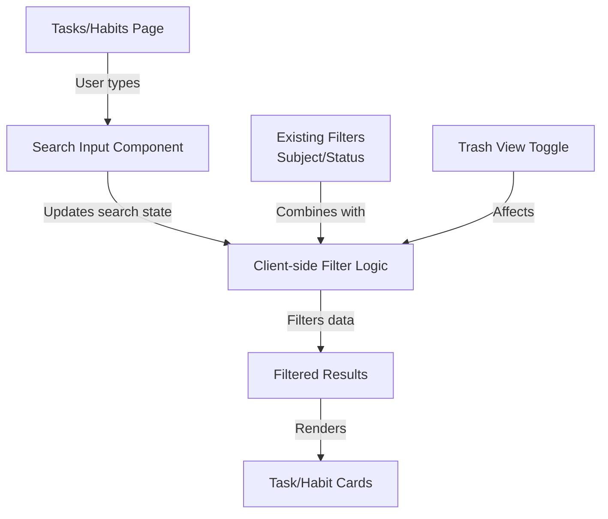

# Design Document: Search Tasks & Habits

## Overview

This feature adds real-time search functionality to both the Tasks and Habits pages in FlowDay. Users can search by title and description (for tasks) or title (for habits) to quickly filter their items. The search works alongside existing filters (subject/status for tasks) and functions in both active and trash views. Search is case-insensitive and provides immediate feedback as users type.

## Architecture



## Components and Interfaces

### Search Input Component

**Purpose**: Provides a text input field for users to enter search queries. Positioned prominently in the filter section.

**Interface**:
```typescript
interface SearchInputProps {
  value: string
  onChange: (value: string) => void
  placeholder?: string
  disabled?: boolean
}

function SearchInput({ value, onChange, placeholder, disabled }: SearchInputProps) {
  return (
    <Input
      type="text"
      value={value}
      onChange={(e) => onChange(e.target.value)}
      placeholder={placeholder || "Cari..."}
      disabled={disabled}
      className="w-full sm:w-[200px]"
    />
  )
}
```

**Responsibilities**:
- Accept user input
- Trigger onChange callback on every keystroke
- Display placeholder text
- Support disabled state during loading

### Filter Logic (Tasks Page)

**Purpose**: Combines search with existing subject/status filters to produce final filtered task list.

**Current Implementation Pattern**:
```typescript
const filteredTasks = useMemo(() => {
  return tasks
    .filter((task) => {
      if (filterSubject !== "all" && task.subject !== filterSubject) return false
      if (filterStatus !== "all" && task.status !== filterStatus) return false
      return true
    })
    .sort((a, b) => {
      if (a.status !== b.status) return a.status === "todo" ? -1 : 1
      return new Date(a.dueDate).getTime() - new Date(b.dueDate).getTime()
    })
}, [tasks, filterSubject, filterStatus])
```

**Enhanced Implementation**:
```typescript
const filteredTasks = useMemo(() => {
  return tasks
    .filter((task) => {
      // Existing filters
      if (filterSubject !== "all" && task.subject !== filterSubject) return false
      if (filterStatus !== "all" && task.status !== filterStatus) return false
      
      // NEW: Search filter (case-insensitive)
      if (searchQuery.trim()) {
        const query = searchQuery.toLowerCase()
        const matchesTitle = task.title.toLowerCase().includes(query)
        const matchesDescription = task.description?.toLowerCase().includes(query) ?? false
        if (!matchesTitle && !matchesDescription) return false
      }
      
      return true
    })
    .sort((a, b) => {
      if (a.status !== b.status) return a.status === "todo" ? -1 : 1
      return new Date(a.dueDate).getTime() - new Date(b.dueDate).getTime()
    })
}, [tasks, filterSubject, filterStatus, searchQuery])
```

**Responsibilities**:
- Combine all filter criteria (subject, status, search)
- Maintain sort order (status first, then due date)
- Recalculate only when dependencies change
- Handle empty search query gracefully

### Filter Logic (Habits Page)

**Purpose**: Filters habits by search query in both active and trash views.

**Implementation**:
```typescript
const filteredHabits = useMemo(() => {
  const dataToFilter = showTrash ? deletedHabits : habits
  
  if (!searchQuery.trim()) {
    return dataToFilter
  }
  
  const query = searchQuery.toLowerCase()
  return dataToFilter.filter((habit) => 
    habit.title.toLowerCase().includes(query)
  )
}, [habits, deletedHabits, showTrash, searchQuery])
```

**Responsibilities**:
- Filter habits by title only (habits don't have descriptions)
- Work in both active and trash views
- Handle empty search query
- Maintain original order

## Data Models

### Task Search Fields

```typescript
interface Task {
  id: string
  title: string              // Searchable
  description: string | null // Searchable
  subject: string            // Filterable (existing)
  status: TaskStatus         // Filterable (existing)
  priority: TaskPriority
  dueDate: string
  createdAt: string
  updatedAt: string
  deletedAt: string | null
}
```

**Search Behavior**:
- Searches both `title` and `description` fields
- Case-insensitive matching
- Partial string matching (substring search)
- Null descriptions are treated as empty strings

### Habit Search Fields

```typescript
interface Habit {
  id: string
  title: string              // Searchable
  currentStreak: number
  createdAt: string
  updatedAt: string
  deletedAt: string | null
}
```

**Search Behavior**:
- Searches `title` field only
- Case-insensitive matching
- Partial string matching (substring search)

## State Management

### Tasks Page State

```typescript
// Existing state
const [filterSubject, setFilterSubject] = useState<string>("all")
const [filterStatus, setFilterStatus] = useState<string>("all")
const [showTrash, setShowTrash] = useState(false)

// NEW: Search state
const [searchQuery, setSearchQuery] = useState<string>("")
```

**State Lifecycle**:
- Initialize as empty string
- Update on every keystroke
- Clear when switching between active/trash views (optional UX enhancement)
- Persist during filter changes

### Habits Page State

```typescript
// Existing state
const [showTrash, setShowTrash] = useState(false)

// NEW: Search state
const [searchQuery, setSearchQuery] = useState<string>("")
```

**State Lifecycle**:
- Initialize as empty string
- Update on every keystroke
- Clear when switching between active/trash views (optional UX enhancement)

## UI Layout

### Tasks Page Filter Section

**Current Layout**:
```
[Subject Dropdown] [Status Dropdown]
```

**Enhanced Layout**:
```
[Search Input] [Subject Dropdown] [Status Dropdown]
```

**Responsive Behavior**:
- Desktop: All filters in one row
- Mobile: Search input full width, dropdowns wrap below
- Search input width: 200px on desktop, full width on mobile

### Habits Page Filter Section

**Current Layout**:
- No filter section (only header with trash toggle)

**Enhanced Layout**:
- Add search input above the weekly tracker
- Position: Between header and stats cards
- Width: Full width on mobile, 200px on desktop

## Correctness Properties

### Property 1: Search Results Subset
**Statement**: All search results must be a subset of the current filtered data (subject/status filters for tasks).

**Formal Specification**:
```
∀ task ∈ filteredTasks:
  (task.title.toLowerCase().includes(searchQuery.toLowerCase()) ∨ 
   task.description?.toLowerCase().includes(searchQuery.toLowerCase())) ∧
  (filterSubject = "all" ∨ task.subject = filterSubject) ∧
  (filterStatus = "all" ∨ task.status = filterStatus)
```

**Test Case**:
- Given: filterSubject = "Math", filterStatus = "todo", searchQuery = "homework"
- Then: All returned tasks have subject="Math", status="todo", and contain "homework" in title or description

### Property 2: Case-Insensitive Matching
**Statement**: Search matching must be case-insensitive.

**Formal Specification**:
```
∀ task ∈ tasks:
  (task.title.toLowerCase().includes(searchQuery.toLowerCase())) ⟺
  (task.title.includes(searchQuery) ∨ task.title.includes(searchQuery.toUpperCase()) ∨ ...)
```

**Test Cases**:
- Search "homework" matches "Homework", "HOMEWORK", "HoMeWoRk"
- Search "MATH" matches "math", "Math", "MATH"

### Property 3: Empty Search Returns All
**Statement**: Empty or whitespace-only search query returns all items matching other filters.

**Formal Specification**:
```
searchQuery.trim() = "" ⟹ 
  filteredTasks = tasks.filter(subject & status filters)
```

**Test Cases**:
- searchQuery = "" returns all tasks matching subject/status
- searchQuery = "   " (spaces) returns all tasks matching subject/status

### Property 4: Partial String Matching
**Statement**: Search matches any substring within title or description.

**Formal Specification**:
```
∀ task ∈ tasks:
  ∃ substring ⊆ task.title ∨ ∃ substring ⊆ task.description:
    substring.toLowerCase() = searchQuery.toLowerCase() ⟹ task ∈ results
```

**Test Cases**:
- Search "work" matches "homework", "coursework", "network"
- Search "due" matches "due date", "overdue", "undue"

### Property 5: Null Description Handling
**Statement**: Tasks with null descriptions are searchable by title only.

**Formal Specification**:
```
∀ task ∈ tasks where task.description = null:
  task ∈ results ⟺ task.title.toLowerCase().includes(searchQuery.toLowerCase())
```

**Test Case**:
- Task with title="Study" and description=null matches search "Study"
- Same task does not match search "notes" (description is null)

### Property 6: Trash View Search
**Statement**: Search works independently in trash view, filtering only deleted items.

**Formal Specification**:
```
showTrash = true ⟹ 
  filteredTasks = deletedTasks.filter(search criteria)
```

**Test Cases**:
- In trash view, search "math" only returns deleted tasks with "math" in title/description
- Switching to active view shows different results for same search query

### Property 7: Filter Combination
**Statement**: Search combines with existing filters using AND logic.

**Formal Specification**:
```
∀ task ∈ results:
  (matchesSearch(task, query) ∧ matchesSubject(task, subject) ∧ matchesStatus(task, status))
```

**Test Cases**:
- filterSubject="Math" AND searchQuery="homework" returns only Math tasks with "homework"
- filterStatus="done" AND searchQuery="project" returns only completed tasks with "project"

## Error Handling

### Scenario 1: No Results Found

**Condition**: Search query matches no items in current filter context

**Response**: 
- Display empty state message
- Show message: "No tasks found matching 'search query'"
- Keep search input visible for user to modify query

**Recovery**: 
- User can clear search or modify query
- User can adjust other filters

### Scenario 2: Special Characters in Search

**Condition**: User enters special characters (%, _, etc.) in search

**Response**:
- Treat as literal characters (no regex interpretation)
- Perform substring matching only

**Recovery**:
- Search still works with literal character matching
- No error message needed

### Scenario 3: Very Long Search Query

**Condition**: User enters very long search string (>100 characters)

**Response**:
- Accept and process normally
- No truncation or error

**Recovery**:
- User can clear and re-enter shorter query

## Testing Strategy

### Unit Testing Approach

**Test Suite 1: Search Filter Logic**
- Test case-insensitive matching
- Test partial string matching
- Test null description handling
- Test empty search query
- Test whitespace-only search query

**Test Suite 2: Filter Combination**
- Test search + subject filter
- Test search + status filter
- Test search + subject + status filters
- Test search in trash view
- Test search in active view

**Test Suite 3: State Management**
- Test search state updates on input change
- Test search state clears on view toggle (if implemented)
- Test search state persists during filter changes

**Test Suite 4: UI Rendering**
- Test search input renders correctly
- Test search input accepts user input
- Test search input disabled state
- Test empty state displays when no results

### Property-Based Testing Approach

**Property Test Library**: `fast-check` (already used in Next.js projects)

**Property 1: Commutativity of Filters**
```
∀ tasks, searchQuery, subject, status:
  filter(filter(tasks, search), subject) = filter(filter(tasks, subject), search)
```

**Property 2: Idempotence of Search**
```
∀ tasks, searchQuery:
  filter(filter(tasks, searchQuery), searchQuery) = filter(tasks, searchQuery)
```

**Property 3: Case Normalization**
```
∀ tasks, query:
  filter(tasks, query) = filter(tasks, query.toLowerCase()) = filter(tasks, query.toUpperCase())
```

**Property 4: Subset Property**
```
∀ tasks, searchQuery:
  |filter(tasks, searchQuery)| ≤ |tasks|
```

### Integration Testing Approach

**Test Scenario 1: Tasks Page Search Flow**
1. Navigate to Tasks page
2. Enter search query "math"
3. Verify filtered results display
4. Change subject filter to "Calculus"
5. Verify results update to show only Calculus tasks with "math"
6. Clear search
7. Verify all Calculus tasks display

**Test Scenario 2: Habits Page Search Flow**
1. Navigate to Habits page
2. Enter search query "morning"
3. Verify filtered habits display
4. Toggle to trash view
5. Verify search filters deleted habits
6. Toggle back to active view
7. Verify search filters active habits again

**Test Scenario 3: Trash View Search**
1. Navigate to Tasks page
2. Toggle to trash view
3. Enter search query
4. Verify only deleted tasks matching query display
5. Restore a task
6. Verify it no longer appears in trash search results

## Performance Considerations

### Client-Side Filtering

**Rationale**: Search is performed client-side using `useMemo` to avoid unnecessary API calls.

**Performance Characteristics**:
- Time Complexity: O(n) where n = number of tasks/habits
- Space Complexity: O(n) for filtered results
- Recalculation: Only when dependencies change (tasks, filters, search query)

**Optimization**:
- `useMemo` prevents recalculation on every render
- String comparison is fast for typical task/habit counts (<1000 items)
- No debouncing needed for client-side filtering

### Scalability

**Current Limits**:
- Efficient for up to ~1000 tasks/habits per user
- If user base grows significantly, consider:
  - Server-side search with pagination
  - Full-text search index in Supabase
  - Debounced API calls for large datasets

**Future Enhancement**:
- Implement server-side search via `getTasks({ search: query })`
- Already supported in `taskService.ts` via `filter.search` parameter
- Habits service would need similar enhancement

## Security Considerations

### Input Validation

**Search Query**:
- No validation needed (treated as literal string)
- Special characters are safe (no regex interpretation)
- XSS prevention: React automatically escapes text content

**Data Exposure**:
- Search only filters user's own tasks/habits (enforced by Supabase RLS)
- No sensitive data in search results beyond what user already sees

### Privacy

- Search queries are not logged or tracked
- Search is performed locally in browser
- No analytics on search terms

## Dependencies

### Existing Dependencies
- React (hooks: useState, useMemo)
- React Query (useGetTasks, useGetHabits)
- UI Components (Input, Select, Button)
- date-fns (date formatting)

### New Dependencies
- None required (uses existing libraries)

### Optional Dependencies
- `fast-check` for property-based testing (if not already installed)

## Implementation Notes

### Key Decisions

1. **Client-Side vs Server-Side**: Client-side filtering chosen for:
   - Instant feedback (no network latency)
   - Reduced server load
   - Works offline (PWA feature)
   - Existing pattern in codebase (filteredTasks useMemo)

2. **Search Scope**: 
   - Tasks: title + description (comprehensive search)
   - Habits: title only (habits don't have descriptions)

3. **Case Sensitivity**: 
   - Case-insensitive for better UX
   - Users expect "Math" to match "math"

4. **Partial Matching**: 
   - Substring matching chosen over exact matching
   - More intuitive for users
   - Matches user expectations

5. **Filter Combination**: 
   - AND logic (all filters must match)
   - More restrictive, helps users narrow down results
   - Matches existing filter behavior

### Migration Path

1. Add search state to Tasks page
2. Add search input to Tasks page filter section
3. Update filteredTasks useMemo to include search logic
4. Add search state to Habits page
5. Add search input to Habits page
6. Update habits filtering logic
7. Test in both active and trash views
8. No database changes required

### Backward Compatibility

- Fully backward compatible
- Existing filters continue to work
- No API changes required
- No data model changes
