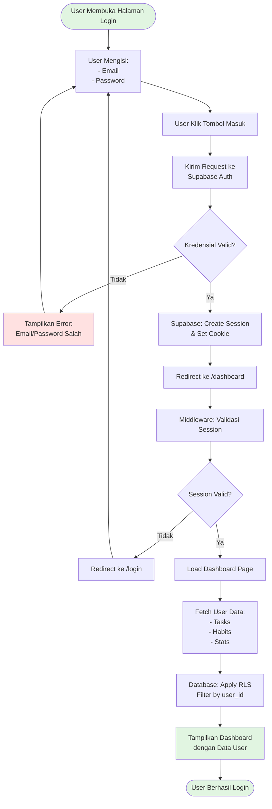
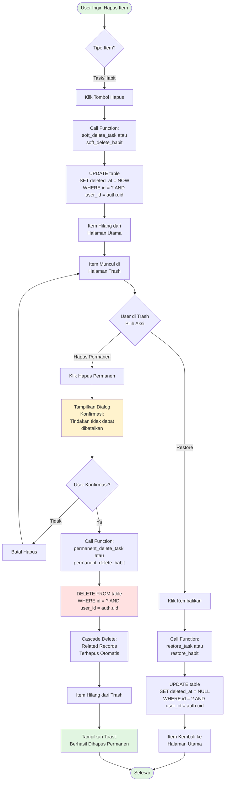

# ACTIVITY DIAGRAMS - FlowDay Project
# Task & Habit Management System

---

## 📋 DAFTAR ISI

1. [Activity Diagram: User Registration](#1-activity-diagram-user-registration)
2. [Activity Diagram: User Login](#2-activity-diagram-user-login)
3. [Activity Diagram: Manage Tasks (CRUD)](#3-activity-diagram-manage-tasks-crud)
4. [Activity Diagram: Manage Habits](#4-activity-diagram-manage-habits)
5. [Activity Diagram: Soft Delete & Hard Delete](#5-activity-diagram-soft-delete--hard-delete)
6. [Activity Diagram: Search & Filter Tasks](#6-activity-diagram-search--filter-tasks)
7. [Activity Diagram: View Analytics](#7-activity-diagram-view-analytics)
8. [Activity Diagram: Complete System Flow](#8-activity-diagram-complete-system-flow)

---

## 1. Activity Diagram: User Registration

**Penjelasan:**
- User mengisi form registrasi dengan nama, email, password, dan konfirmasi password
- Validasi client-side memastikan password dan konfirmasi password cocok
- Request dikirim ke Supabase Auth API
- Server memvalidasi email dan password (min 6 karakter)
- Jika valid, user dibuat di tabel `auth.users`
- Database trigger `handle_new_user` otomatis membuat profile di `public.profiles`
- User diarahkan ke halaman login

---

## 2. Activity Diagram: User Login

**Penjelasan:**
- User memasukkan email dan password
- Kredensial divalidasi oleh Supabase Auth
- Jika valid, session dibuat dan cookie di-set
- Middleware memvalidasi session sebelum akses dashboard
- Row Level Security (RLS) memastikan user hanya melihat data miliknya
- Dashboard ditampilkan dengan data user yang sudah terfilter

---

## 3. Activity Diagram: Manage Tasks (CRUD)

**Penjelasan:**
- **CREATE**: User mengisi form dan data di-insert ke database
- **READ**: Tasks di-load dengan RLS filter, bisa ditambah filter subject/status/search
- **UPDATE**: User edit task, data di-update dengan trigger auto-update timestamp
- **DELETE**: Soft delete dengan set `deleted_at`, task pindah ke trash
- **TOGGLE**: Checkbox untuk toggle status todo/done

---

## 4. Activity Diagram: Manage Habits

**Penjelasan:**
- **CREATE**: User membuat habit baru dengan nama, initial streak = 0
- **TOGGLE**: User centang/uncentang habit di tracker grid
  - Jika log belum ada, insert baru
  - Jika sudah ada, toggle completed status
  - Trigger otomatis recalculate streak
- **STATS**: RPC function join habits dengan habit_logs untuk hitung completion rate
- **DELETE**: Soft delete habit ke trash

---

## 5. Activity Diagram: Soft Delete & Hard Delete

**Penjelasan:**
- **SOFT DELETE**: 
  - Set `deleted_at = NOW()`
  - Item hilang dari halaman utama
  - Item muncul di trash
  - Data masih ada di database
  
- **RESTORE**:
  - Set `deleted_at = NULL`
  - Item kembali ke halaman utama
  - Reversible action
  
- **HARD DELETE**:
  - Tampilkan konfirmasi dialog
  - DELETE FROM database
  - Cascade delete untuk related records (habit_logs)
  - Irreversible action

---

## 6. Activity Diagram: Search & Filter Tasks

**Penjelasan:**
- Tasks di-load dari database dengan RLS filter
- **Search**: Real-time filter berdasarkan title atau description (case-insensitive)
- **Filter Subject**: Filter berdasarkan mata kuliah yang dipilih
- **Filter Status**: Filter berdasarkan status (todo/done)
- **Combined**: Semua filter bisa dikombinasikan
- Filter dilakukan di client-side menggunakan `useMemo` untuk performa optimal
- Empty state ditampilkan jika tidak ada hasil

---

## 7. Activity Diagram: View Analytics

**Penjelasan:**
- Analytics page melakukan **5 query paralel** untuk performa optimal
- **Dashboard Summary**: Agregasi total tasks, habits, streak
- **Weekly Stats**: JOIN tasks dengan generate_series untuk 7 hari terakhir, tampil di bar chart
- **Subject Stats**: GROUP BY subject untuk breakdown per mata kuliah
- **Habit Stats**: JOIN habits dengan habit_logs untuk hitung completion rate 30 hari
- **Priority Breakdown**: Group tasks by priority (high/medium/low)
- Semua query menggunakan RLS untuk filter user_id
- React Query melakukan caching untuk performa

---

## 8. Activity Diagram: Complete System Flow

**Penjelasan Complete Flow:**
1. **Authentication Check**: Middleware validasi session
2. **Landing/Auth**: Login atau register untuk user baru
3. **Dashboard**: Overview stats dan recent activities
4. **Tasks Management**: CRUD, search, filter, soft delete
5. **Habits Management**: Create, toggle, view stats, soft delete
6. **Analytics**: Multiple RPC queries untuk charts dan stats
7. **Trash**: Restore atau permanent delete items
8. **Settings**: Edit profile, manage subjects, toggle theme
9. **Logout**: Clear session dan redirect ke login

---

## 📊 SUMMARY

### Total Activity Diagrams: 8 Diagrams

1. ✅ **User Registration** - Proses pendaftaran user baru
2. ✅ **User Login** - Proses autentikasi dan session management
3. ✅ **Manage Tasks (CRUD)** - Create, Read, Update, Delete, Toggle tasks
4. ✅ **Manage Habits** - Create, toggle, view stats, delete habits
5. ✅ **Soft Delete & Hard Delete** - Trash management dengan restore
6. ✅ **Search & Filter Tasks** - Real-time search dan multiple filters
7. ✅ **View Analytics** - Parallel queries untuk dashboard analytics
8. ✅ **Complete System Flow** - End-to-end user journey

### Key Features Covered:
- ✅ Authentication & Authorization
- ✅ CRUD Operations
- ✅ Soft Delete & Hard Delete
- ✅ Search & Filter
- ✅ JOIN Queries (via RPC)
- ✅ Row Level Security (RLS)
- ✅ Database Triggers
- ✅ Real-time Updates
- ✅ Error Handling
- ✅ User Experience Flow

---

## 🎨 Diagram Format

Semua diagram menggunakan **Mermaid syntax** yang bisa di-render di:
- GitHub
- GitLab
- VS Code (dengan extension)
- Online tools: mermaid.live, mermaid-js.github.io

### Color Legend:
- 🟢 **Hijau** (#e1f5e1): Start, End, Success states
- 🔴 **Merah** (#ffe1e1): Error states, Delete operations
- 🟡 **Kuning** (#fff3cd): Warning, Confirmation dialogs

---

**Dibuat pada**: 1 Mei 2026  
**Project**: FlowDay - Task & Habit Management System  
**Format**: Mermaid Flowchart Diagrams
