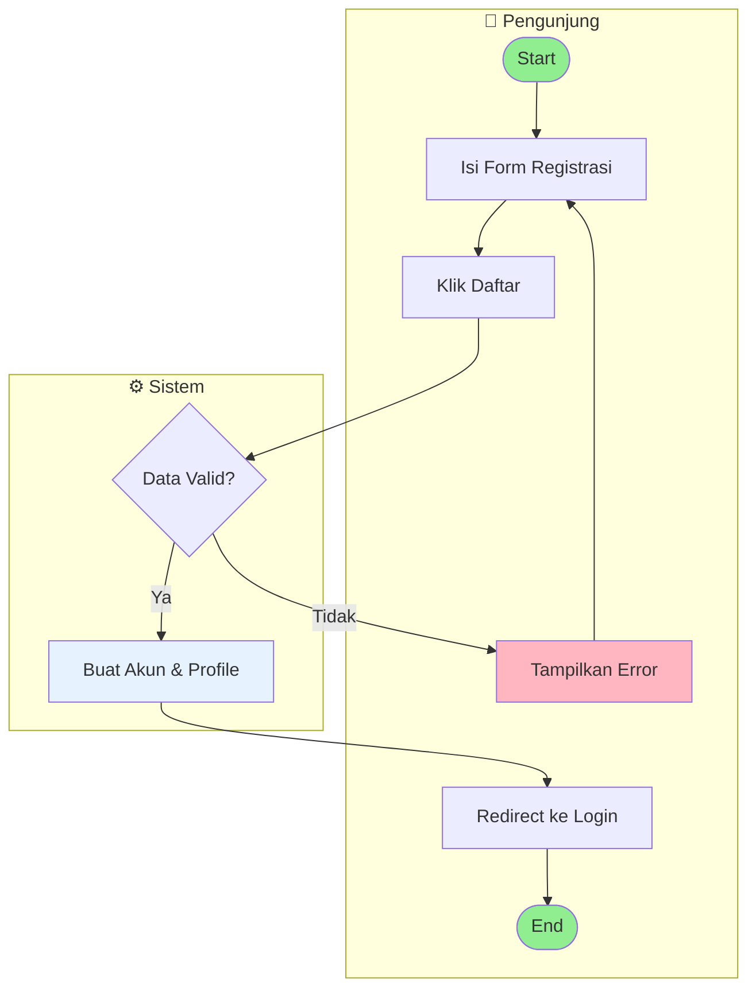
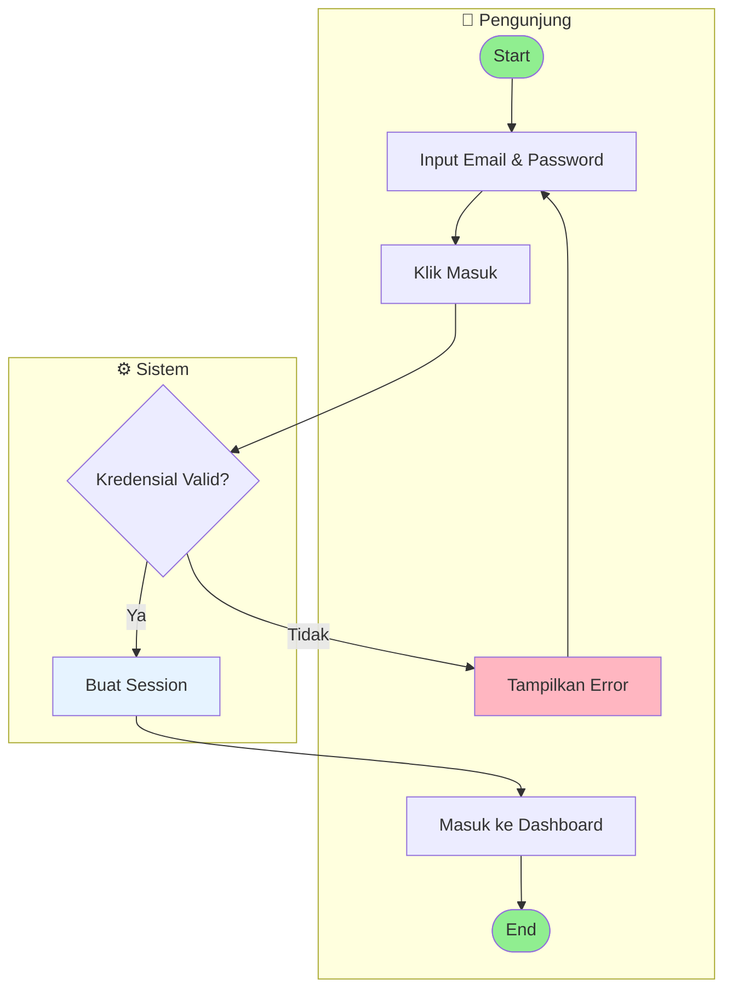
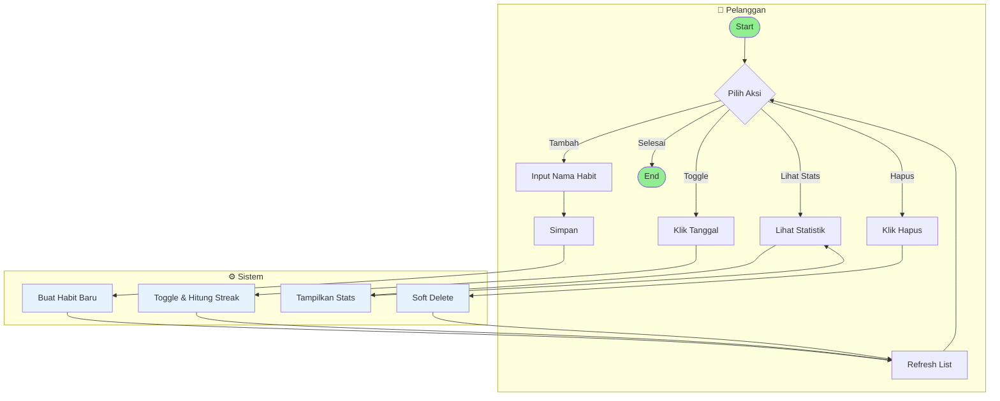
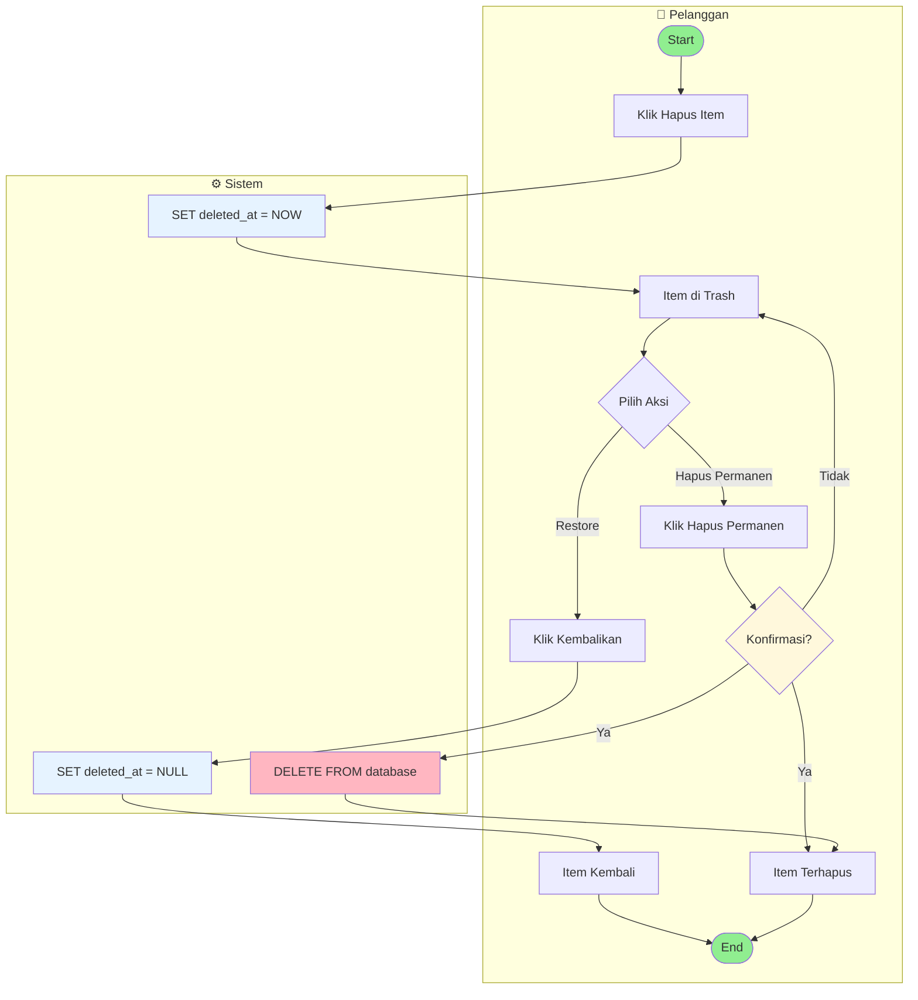
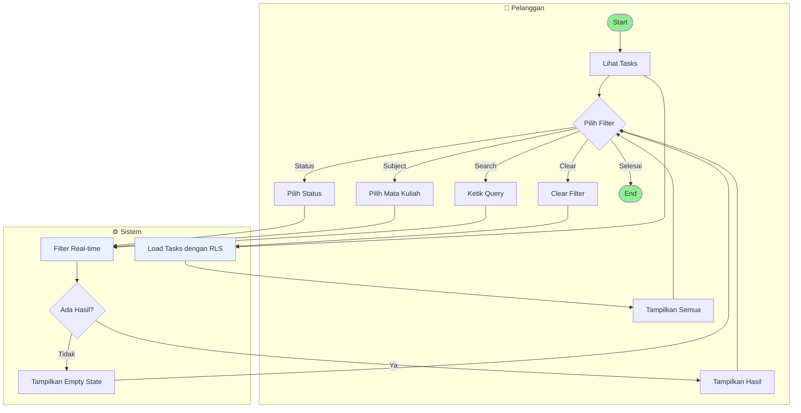
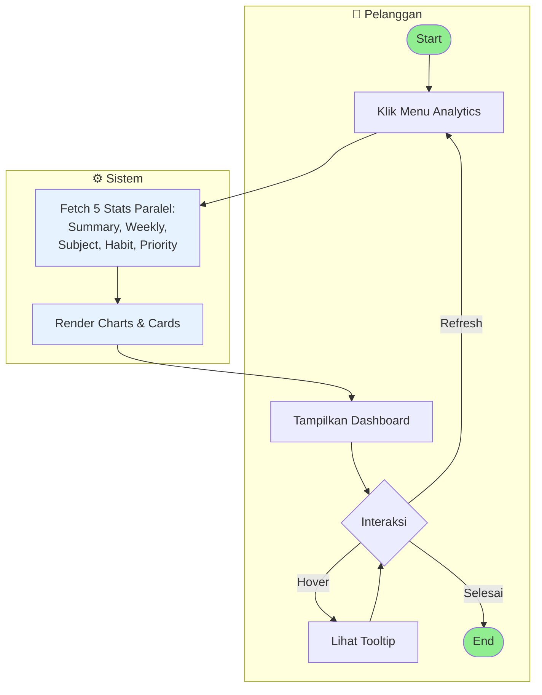
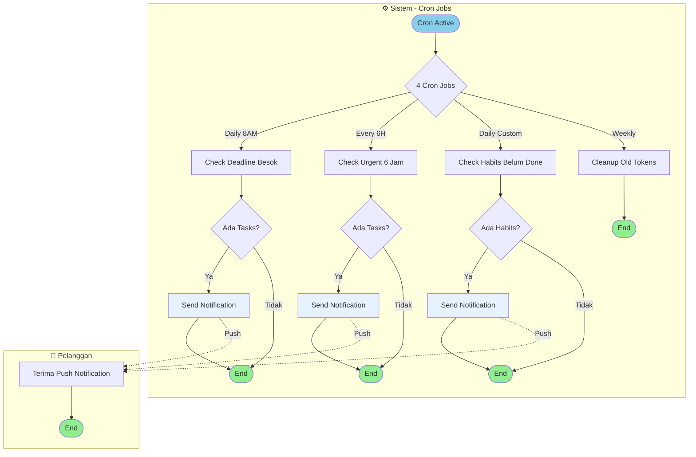

# ACTIVITY DIAGRAMS - FlowDay Project
# Task & Habit Management System

> **Format**: Activity Diagrams menggunakan **Role-Based (Swimlanes)** - Simple & Clean

---

## 📋 DAFTAR ISI

1. [User Registration](#1-user-registration)
2. [User Login](#2-user-login)
3. [Manage Tasks](#3-manage-tasks)
4. [Manage Habits](#4-manage-habits)
5. [Soft Delete & Restore](#5-soft-delete--restore)
6. [Search & Filter](#6-search--filter)
7. [View Analytics](#7-view-analytics)
8. [Notification System](#8-notification-system)

---

## 1. User Registration

**Penjelasan:**
- User mengisi form registrasi (nama, email, password)
- Sistem melakukan validasi data
- Jika valid: sistem membuat akun dan profile otomatis
- User diarahkan ke halaman login

---

## 2. User Login

**Penjelasan:**
- User memasukkan email dan password
- Sistem memvalidasi kredensial
- Jika valid: sistem membuat session dan user masuk ke dashboard
- Jika tidak valid: tampilkan pesan error

---

## 3. Manage Tasks

```mermaid
graph TD
    subgraph User["👤 Pelanggan"]
        A([Start]) --> B{Pilih Aksi}
        B -->|Tambah| C[Isi Form Task]
        B -->|Edit| D[Ubah Data Task]
        B -->|Hapus| E[Klik Hapus]
        B -->|Toggle| F[Klik Checkbox]
        C --> G[Simpan]
        D --> G
        H[Tampilkan Error] --> B
        I[Refresh List] --> B
        B -->|Selesai| J([End])
    end
    
    subgraph System["⚙️ Sistem"]
        K{Valid?}
        K -->|Tidak| H
        K -->|Ya| L[Simpan ke Database]
        L --> I
        M[Soft Delete] --> I
        N[Toggle Status] --> I
    end
    
    G --> K
    E --> M
    F --> N

    style A fill:#90EE90
    style J fill:#90EE90
    style H fill:#FFB6C1
    style L fill:#E6F3FF
    style M fill:#E6F3FF
    style N fill:#E6F3FF
```

**Penjelasan:**
- **Tambah/Edit**: User mengisi form → sistem validasi → simpan ke database
- **Hapus**: Soft delete (item pindah ke trash, masih bisa di-restore)
- **Toggle**: Ubah status task antara todo dan done
- Semua operasi akan refresh list secara otomatis

---

## 4. Manage Habits

**Penjelasan:**
- **Tambah**: User input nama habit → sistem buat habit baru (streak dimulai dari 0)
- **Toggle**: User klik tanggal di tracker → sistem toggle status complete dan hitung ulang streak
- **Stats**: Sistem menampilkan completion rate dan current streak
- **Hapus**: Soft delete habit ke trash

---

## 5. Soft Delete & Restore

**Penjelasan:**
- **Soft Delete**: Item pindah ke trash (data masih ada di database, bisa di-restore)
- **Restore**: Item dikembalikan ke halaman utama
- **Hard Delete**: Hapus permanen dari database dengan konfirmasi (tidak bisa dikembalikan)

---

## 6. Search & Filter

**Penjelasan:**
- Sistem load tasks dengan Row Level Security (RLS) filter
- User bisa melakukan search berdasarkan title/description
- User bisa filter berdasarkan subject (mata kuliah) atau status (todo/done)
- Filter dilakukan real-time di client-side untuk performa optimal
- Tampilkan empty state jika tidak ada hasil yang cocok

---

## 7. View Analytics

**Penjelasan:**
- User mengklik menu analytics
- Sistem melakukan 5 query paralel untuk performa optimal:
  - Dashboard Summary (total tasks, habits, streak)
  - Weekly Stats (progress 7 hari terakhir)
  - Subject Stats (breakdown per mata kuliah)
  - Habit Stats (completion rate 30 hari)
  - Priority Breakdown (high/medium/low)
- Sistem render charts dan stats cards
- User bisa hover untuk melihat tooltip detail

---

## 8. Notification System

**Penjelasan:**
- **4 Cron Jobs** berjalan otomatis di background:
  1. **Daily 8AM**: Cek tasks yang deadline besok → kirim notifikasi pengingat
  2. **Every 6H**: Cek tasks urgent (deadline <6 jam) → kirim notifikasi urgent
  3. **Daily Custom**: Cek habits yang belum done hari ini → kirim reminder sesuai waktu user
  4. **Weekly**: Cleanup FCM tokens yang sudah tidak aktif >30 hari
- User menerima push notification di device mereka
- Semua notifikasi mengecek user preferences terlebih dahulu

---

## 📝 CATATAN FORMAT DIAGRAM

### Role-Based Activity Diagrams (Swimlanes)

Semua activity diagram menggunakan format **role-based** dengan **swimlanes** untuk memisahkan tanggung jawab:

1. **👤 Pengunjung (Guest)** - User yang belum login
2. **👤 Pelanggan (Customer)** - User yang sudah login  
3. **⚙️ Sistem** - Backend system, database, API, cron jobs

### Keuntungan Format Role-Based:

- ✅ **Pemisahan Tanggung Jawab yang Jelas**: Mudah melihat siapa yang melakukan apa
- ✅ **Identifikasi Interaksi**: Jelas terlihat komunikasi antara user dan sistem
- ✅ **Debugging Lebih Mudah**: Cepat menemukan di mana masalah terjadi (client-side vs server-side)
- ✅ **Dokumentasi Lebih Baik**: Memudahkan developer baru memahami flow aplikasi
- ✅ **Sesuai Standar UML**: Mengikuti best practice activity diagram dengan swimlanes

### Konvensi Warna:

- 🟢 **Hijau (#90EE90)**: Start, End, Success states
- 🔴 **Merah Muda (#FFB6C1)**: Error states, Failed operations
- 🟡 **Kuning Muda (#FFF8DC)**: Warning, Confirmation dialogs
- 🔵 **Biru Muda (#87CEEB, #E6F3FF)**: System processes, Cron jobs

### Simbol Koneksi:

- **→ (Solid Arrow)**: Alur normal/synchronous
- **-.-> (Dashed Arrow)**: Alur asynchronous (contoh: push notification)

---

**Version**: 3.0 (Simple & Clean)  
**Last Updated**: 2026-05-06  
**Author**: FlowDay Development Team
