# ACTIVITY DIAGRAMS - FlowDay Project
# Task & Habit Management System

> **Format**: Activity Diagrams menggunakan **Role-Based (Swimlanes)** - Simple & Clean

---

## 📋 DAFTAR ISI

1. [User Registration](#1-user-registration)
2. [User Login](#2-user-login)
3. [Manage Tasks](#3-manage-tasks)
4. [Manage Habits](#4-manage-habits)
5. [Soft Delete & Restore](#5-soft-delete--restore)
6. [Search & Filter](#6-search--filter)
7. [View Analytics](#7-view-analytics)
8. [Notification System](#8-notification-system)
9. [Enable Push Notifications](#9-enable-push-notifications)
10. [Configure Notification Settings](#10-configure-notification-settings)
11. [Complete System Flow](#11-complete-system-flow)

---

## 1. User Registration

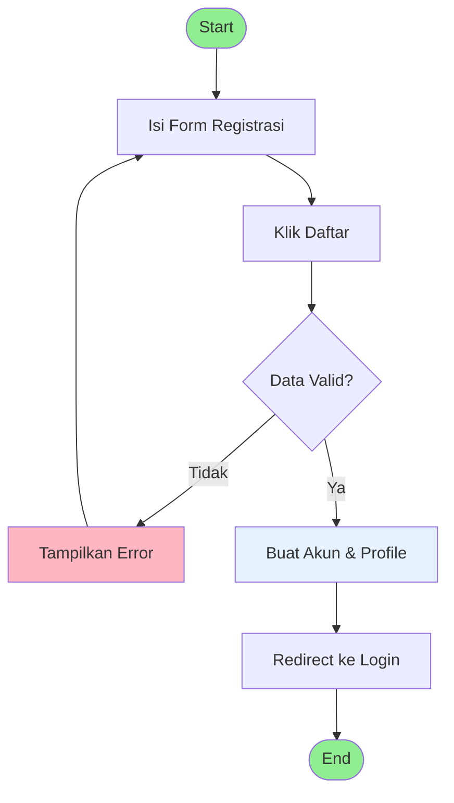

**Penjelasan:**
- User isi form (nama, email, password) → klik daftar
- Sistem validasi → jika valid: buat akun & profile
- Redirect ke login

---

## 2. User Login

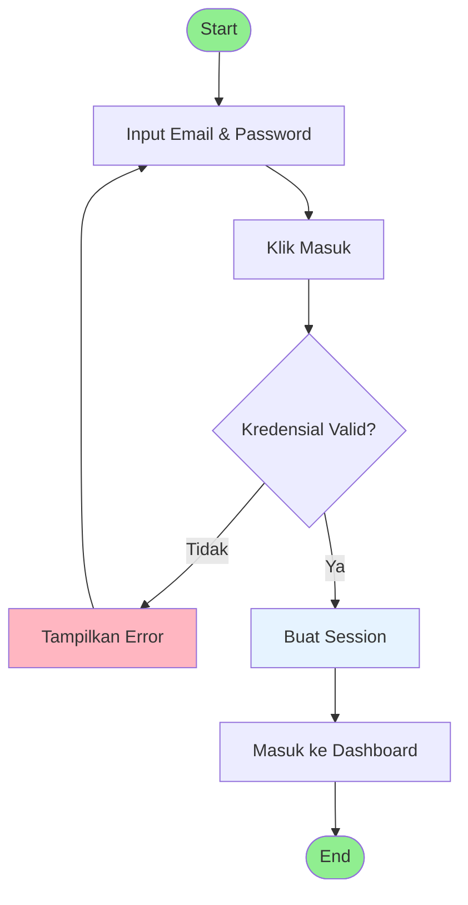

**Penjelasan:**
- User input email & password → klik masuk
- Sistem validasi → jika valid: buat session
- Masuk ke dashboard

---

## 3. Manage Tasks

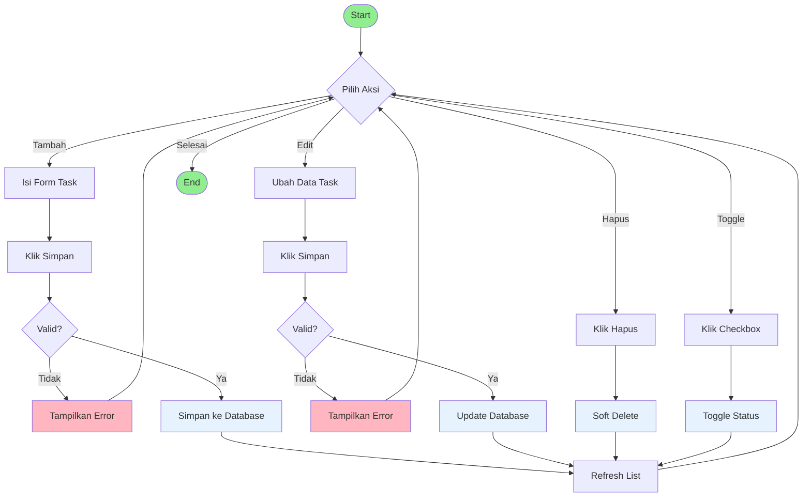

**Penjelasan:**
- **Tambah/Edit**: Isi form → validasi → simpan
- **Hapus**: Soft delete (pindah ke trash)
- **Toggle**: Ubah status todo ↔ done

---

## 4. Manage Habits

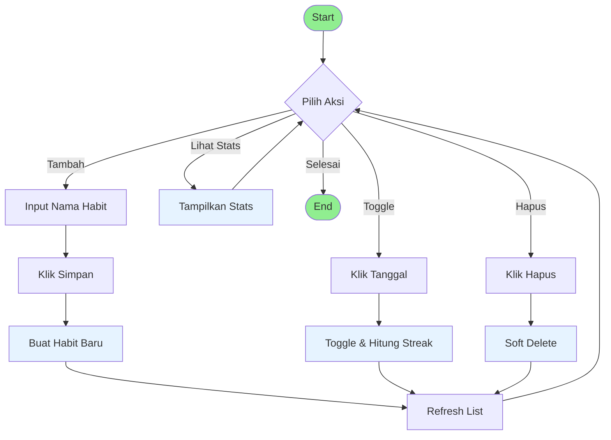

**Penjelasan:**
- **Tambah**: Input nama → buat habit (streak = 0)
- **Toggle**: Klik tanggal → toggle & hitung streak
- **Stats**: Tampilkan completion rate & streak
- **Hapus**: Soft delete ke trash

---

## 5. Soft Delete & Restore

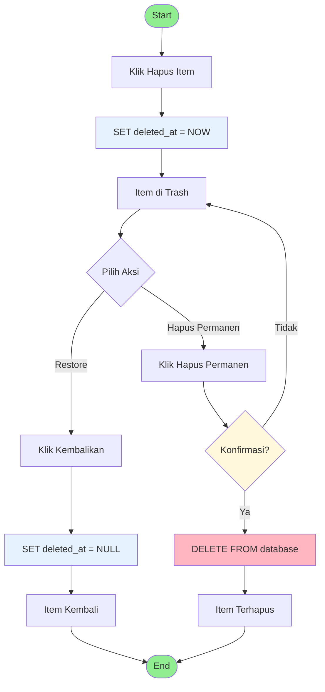

**Penjelasan:**
- **Soft Delete**: Item pindah ke trash (bisa di-restore)
- **Restore**: Item kembali ke halaman utama
- **Hard Delete**: Hapus permanen (tidak bisa dikembalikan)

---

## 6. Search & Filter

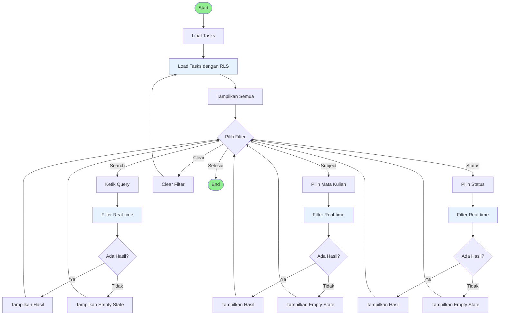

**Penjelasan:**
- Load tasks dengan RLS filter
- User bisa search atau filter (subject/status)
- Filter real-time di client-side
- Tampilkan empty state jika tidak ada hasil

---

## 7. View Analytics

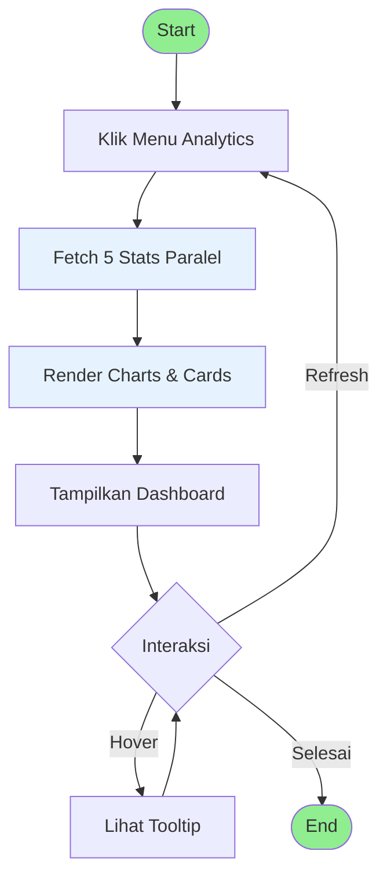

**Penjelasan:**
- User klik menu analytics
- Sistem fetch 5 query paralel
- Render charts & stats cards
- User bisa hover untuk tooltip detail

---

## 8. Notification System

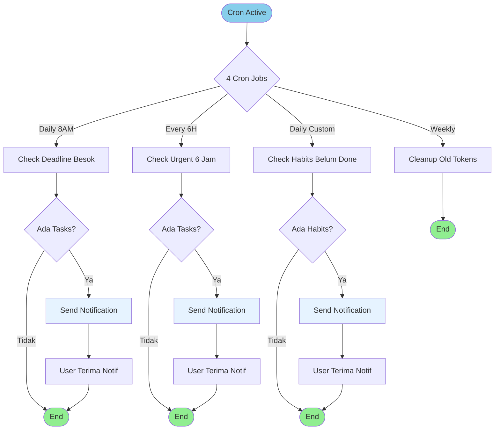

**Penjelasan:**
- **4 Cron Jobs** berjalan otomatis:
  - Daily 8AM: Notif deadline besok
  - Every 6H: Notif urgent (deadline <6 jam)
  - Daily custom: Notif habit reminder
  - Weekly: Cleanup token lama
- User terima push notification di device

---

## 9. Enable Push Notifications

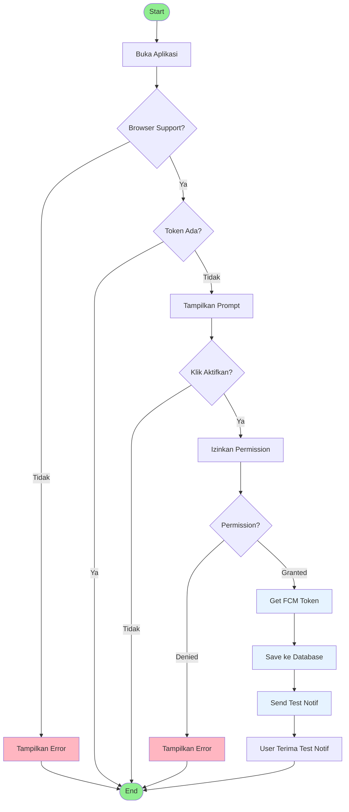

**Penjelasan:**
- Cek browser support push notification
- Jika support: tampilkan prompt
- User izinkan permission → sistem get FCM token
- Save token ke database → send test notification

---

## 10. Configure Notification Settings

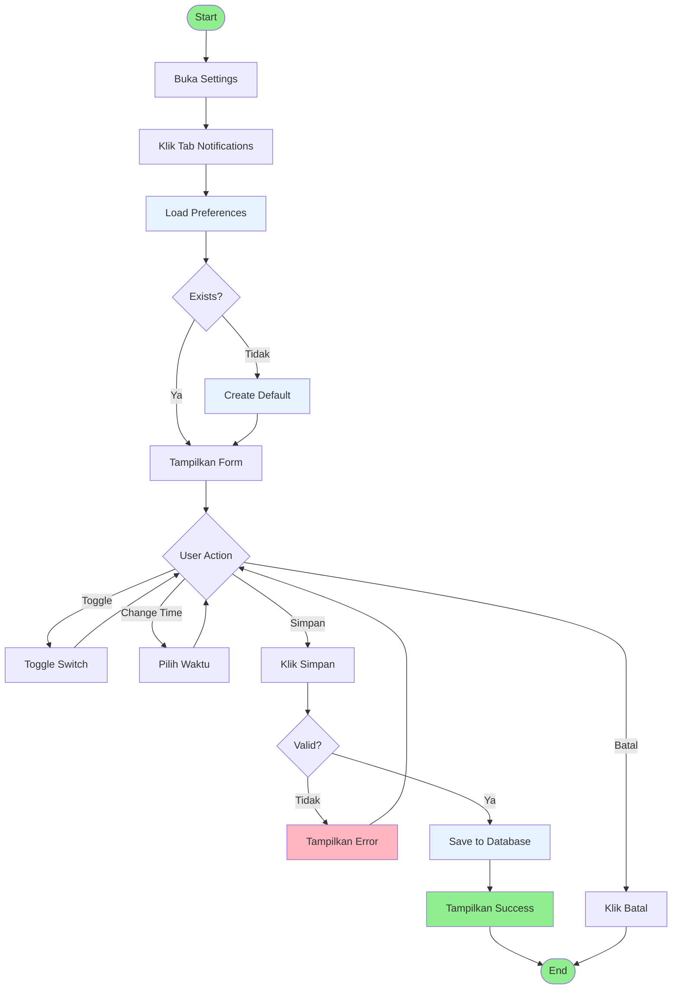

**Penjelasan:**
- Load preferences (create default jika belum ada)
- User bisa toggle switches & ubah waktu
- Simpan → validasi → save to database
- Batal → kembali tanpa save

---

## 11. Complete System Flow

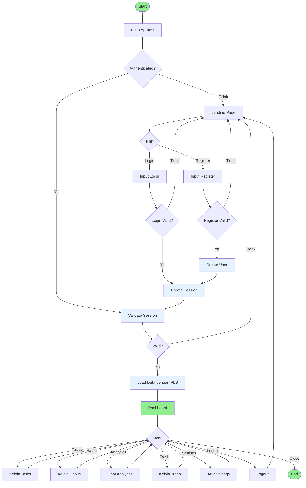

**Penjelasan:**
- **Authentication**: Cek session → jika tidak valid: landing page
- **Login/Register**: Validasi → create session → dashboard
- **Dashboard**: Menu utama (tasks, habits, analytics, trash, settings)
- **Logout**: Clear session → kembali ke landing

---

## 📝 CATATAN

### Format Diagram

Semua diagram menggunakan **role-based swimlanes**:
- 👤 **Pengunjung/Pelanggan**: User actions
- ⚙️ **Sistem**: Backend processes

### Konvensi Warna

- 🟢 **Hijau (#90EE90)**: Start, End, Success
- 🔴 **Merah Muda (#FFB6C1)**: Error
- 🟡 **Kuning (#FFF8DC)**: Warning/Confirmation
- 🔵 **Biru Muda (#E6F3FF)**: System processes

### Simbol

- **→** (Solid): Alur synchronous
- **-.->** (Dashed): Alur asynchronous (push notification)

---

**Version**: 3.0 (Simple & Clean)  
**Last Updated**: 2026-05-06  
**Author**: FlowDay Development Team
