# ACTIVITY DIAGRAMS - FlowDay Project
# Task & Habit Management System

> **Format**: Activity Diagrams menggunakan **Role-Based (Swimlanes)** untuk memisahkan aktivitas antara **User/Pengunjung/Pelanggan** dan **Sistem**.

---

## 📋 DAFTAR ISI

1. [Activity Diagram: User Registration](#1-activity-diagram-user-registration)
2. [Activity Diagram: User Login](#2-activity-diagram-user-login)
3. [Activity Diagram: Manage Tasks (CRUD)](#3-activity-diagram-manage-tasks-crud)
4. [Activity Diagram: Manage Habits](#4-activity-diagram-manage-habits)
5. [Activity Diagram: Soft Delete & Hard Delete](#5-activity-diagram-soft-delete--hard-delete)
6. [Activity Diagram: Search & Filter Tasks](#6-activity-diagram-search--filter-tasks)
7. [Activity Diagram: View Analytics](#7-activity-diagram-view-analytics)
8. [Activity Diagram: Notification System](#8-activity-diagram-notification-system) 
9. [Activity Diagram: Enable Push Notifications](#9-activity-diagram-enable-push-notifications) 
10. [Activity Diagram: Send Deadline Notification (Cron)](#10-activity-diagram-send-deadline-notification-cron) 
11. [Activity Diagram: Configure Notification Preferences](#11-activity-diagram-configure-notification-preferences) 
12. [Activity Diagram: Complete System Flow](#12-activity-diagram-complete-system-flow)

---

## 1. Activity Diagram: User Registration

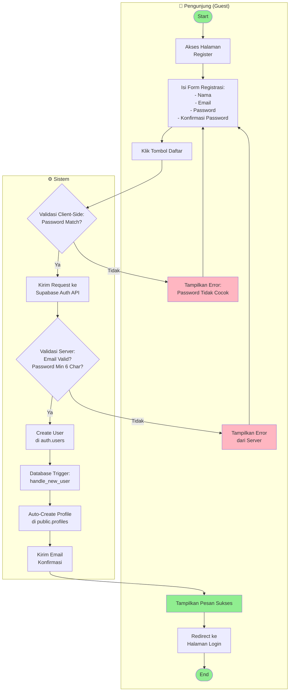

**Penjelasan:**
- **Role User (Pengunjung/Guest)**: Mengakses halaman register, mengisi form, menerima feedback
- **Role Sistem**: Melakukan validasi client-side dan server-side, membuat user di database, trigger auto-create profile, mengirim email konfirmasi
- User mengisi form registrasi dengan nama, email, password, dan konfirmasi password
- Validasi client-side memastikan password dan konfirmasi password cocok
- Request dikirim ke Supabase Auth API
- Server memvalidasi email dan password (min 6 karakter)
- Jika valid, user dibuat di tabel `auth.users`
- Database trigger `handle_new_user` otomatis membuat profile di `public.profiles`
- User diarahkan ke halaman login

---

## 2. Activity Diagram: User Login

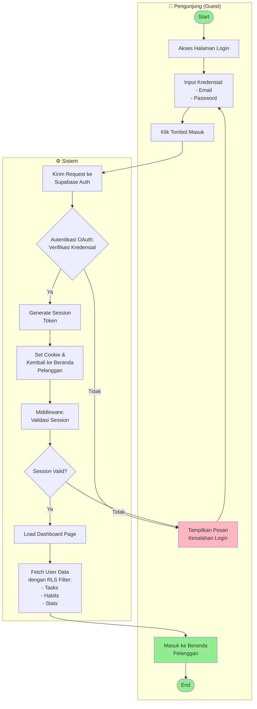

**Penjelasan:**
- **Role User (Pengunjung/Guest)**: Mengakses halaman login, input kredensial, menerima feedback
- **Role Sistem**: Autentikasi OAuth, generate session token, validasi session, fetch data dengan RLS
- User memasukkan email dan password
- Kredensial divalidasi oleh Supabase Auth
- Jika valid, session dibuat dan cookie di-set
- Middleware memvalidasi session sebelum akses dashboard
- Row Level Security (RLS) memastikan user hanya melihat data miliknya
- Dashboard ditampilkan dengan data user yang sudah terfilter

---

## 3. Activity Diagram: Manage Tasks (CRUD)

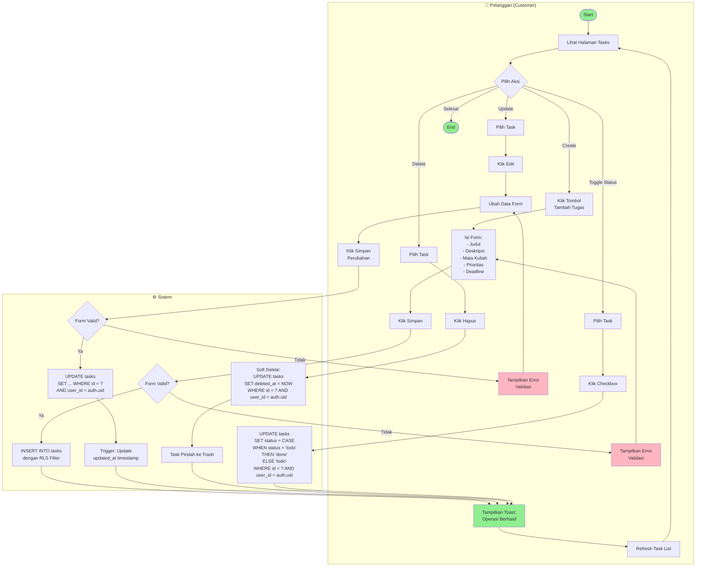

**Penjelasan:**
- **Role User (Pelanggan/Customer)**: Melihat tasks, memilih aksi (create/update/delete/toggle), menerima feedback
- **Role Sistem**: Validasi form, operasi database (INSERT/UPDATE/DELETE), trigger update timestamp, apply RLS
- **CREATE**: User mengisi form dan sistem insert data ke database dengan RLS filter
- **UPDATE**: User edit task, sistem update data dengan trigger auto-update timestamp
- **DELETE**: Soft delete dengan set `deleted_at`, task pindah ke trash
- **TOGGLE**: Checkbox untuk toggle status todo/done

---

## 4. Activity Diagram: Manage Habits

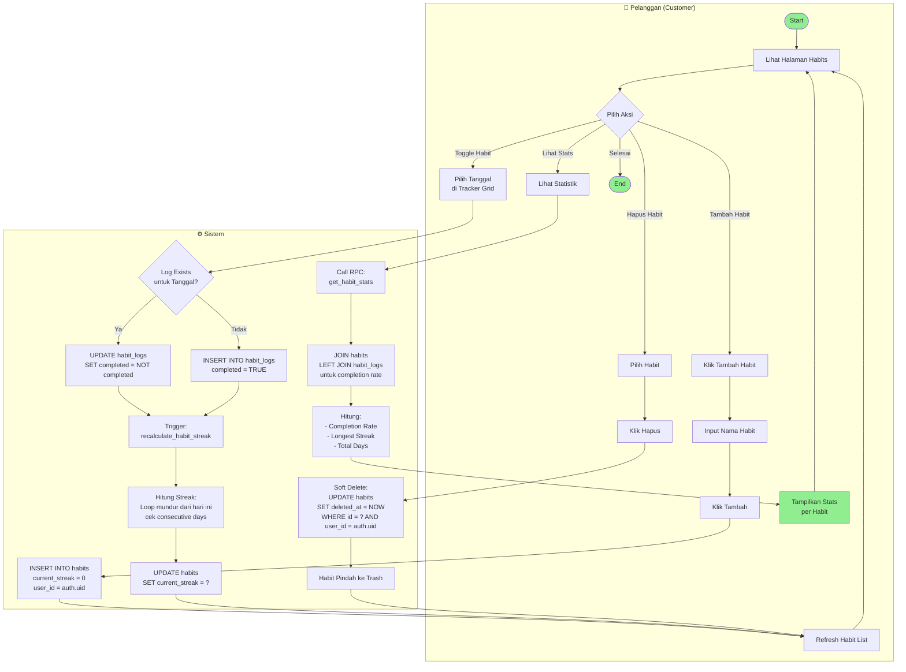

**Penjelasan:**
- **Role User (Pelanggan/Customer)**: Melihat habits, memilih aksi (create/toggle/view stats/delete)
- **Role Sistem**: Insert/update database, recalculate streak dengan trigger, join tables untuk stats
- **CREATE**: User membuat habit baru dengan nama, sistem set initial streak = 0
- **TOGGLE**: User centang/uncentang habit di tracker grid
  - Jika log belum ada, sistem insert baru
  - Jika sudah ada, sistem toggle completed status
  - Trigger otomatis recalculate streak
- **STATS**: RPC function join habits dengan habit_logs untuk hitung completion rate
- **DELETE**: Soft delete habit ke trash

---

## 5. Activity Diagram: Soft Delete & Hard Delete

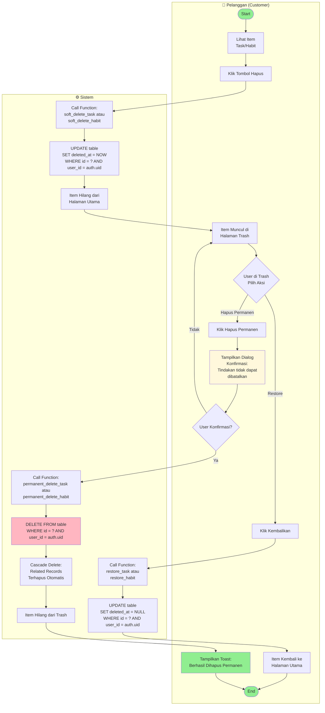

**Penjelasan:**
- **Role User (Pelanggan/Customer)**: Klik hapus, lihat item di trash, pilih restore atau hapus permanen, konfirmasi
- **Role Sistem**: Soft delete (UPDATE deleted_at), restore (SET deleted_at = NULL), hard delete (DELETE FROM), cascade delete
- **SOFT DELETE**: 
  - Sistem set `deleted_at = NOW()`
  - Item hilang dari halaman utama
  - Item muncul di trash
  - Data masih ada di database
  
- **RESTORE**:
  - Sistem set `deleted_at = NULL`
  - Item kembali ke halaman utama
  - Reversible action
  
- **HARD DELETE**:
  - Sistem tampilkan konfirmasi dialog
  - DELETE FROM database
  - Cascade delete untuk related records (habit_logs)
  - Irreversible action

---

## 6. Activity Diagram: Search & Filter Tasks

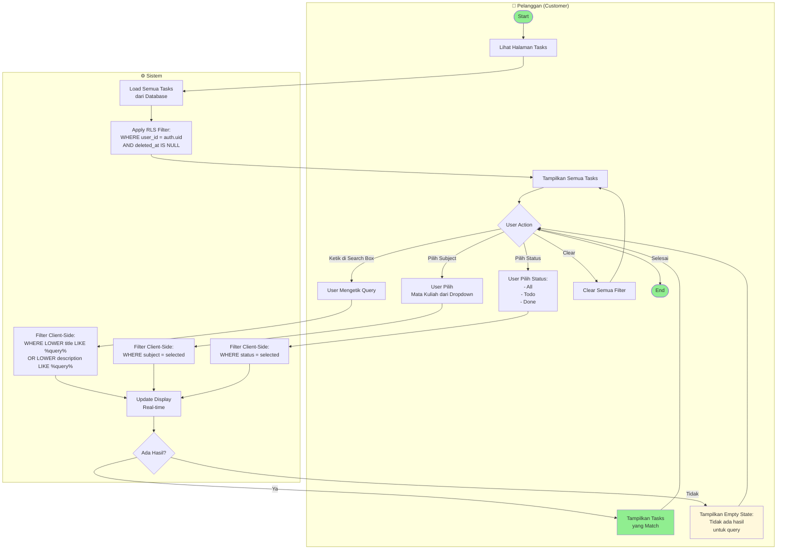

**Penjelasan:**
- **Role User (Pelanggan/Customer)**: Melihat tasks, mengetik search query, memilih filter subject/status, clear filter
- **Role Sistem**: Load tasks dengan RLS, apply filter client-side, update display real-time, cek hasil
- Tasks di-load dari database dengan RLS filter
- **Search**: Real-time filter berdasarkan title atau description (case-insensitive)
- **Filter Subject**: Filter berdasarkan mata kuliah yang dipilih
- **Filter Status**: Filter berdasarkan status (todo/done)
- **Combined**: Semua filter bisa dikombinasikan
- Filter dilakukan di client-side menggunakan `useMemo` untuk performa optimal
- Empty state ditampilkan jika tidak ada hasil

---

## 7. Activity Diagram: View Analytics

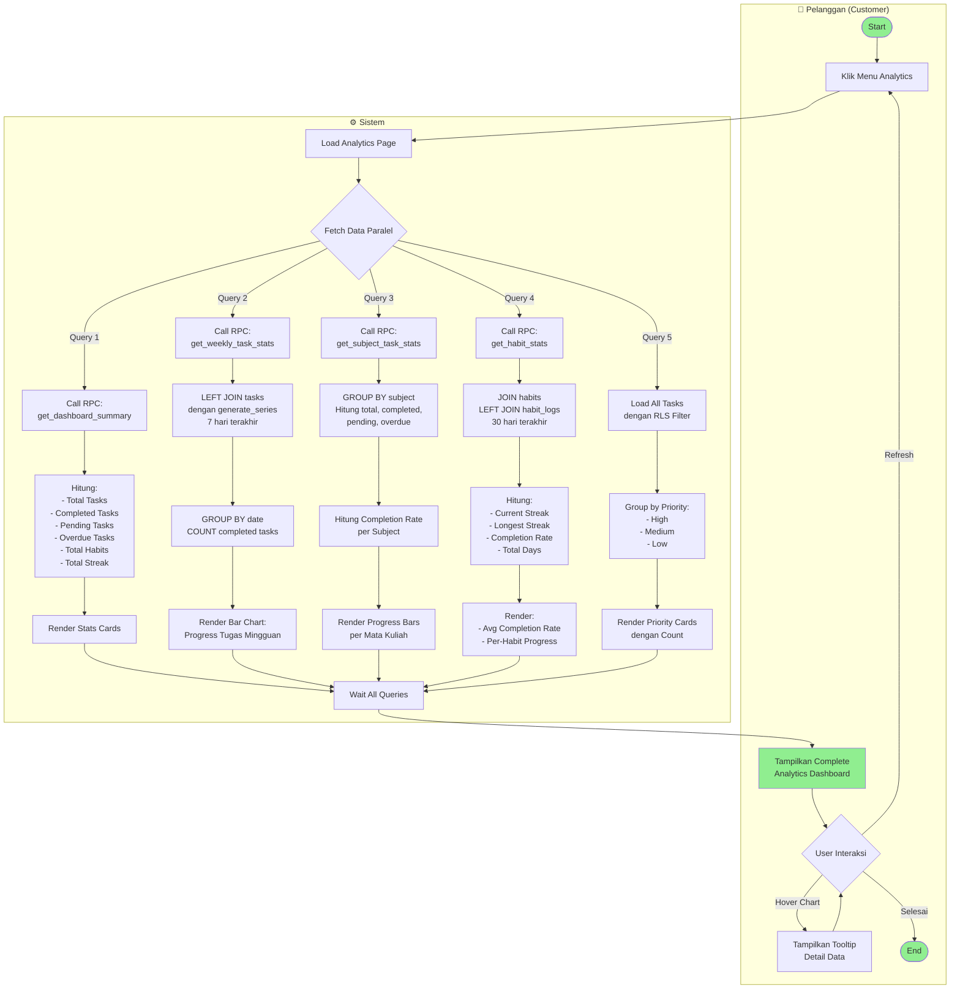

**Penjelasan:**
- **Role User (Pelanggan/Customer)**: Klik menu analytics, lihat dashboard, hover chart untuk tooltip, refresh
- **Role Sistem**: Load page, fetch 5 query paralel (RPC), render charts dan stats cards
- Analytics page melakukan **5 query paralel** untuk performa optimal
- **Dashboard Summary**: Agregasi total tasks, habits, streak
- **Weekly Stats**: JOIN tasks dengan generate_series untuk 7 hari terakhir, tampil di bar chart
- **Subject Stats**: GROUP BY subject untuk breakdown per mata kuliah
- **Habit Stats**: JOIN habits dengan habit_logs untuk hitung completion rate 30 hari
- **Priority Breakdown**: Group tasks by priority (high/medium/low)
- Semua query menggunakan RLS untuk filter user_id
- React Query melakukan caching untuk performa

---

## 8. Activity Diagram: Notification System

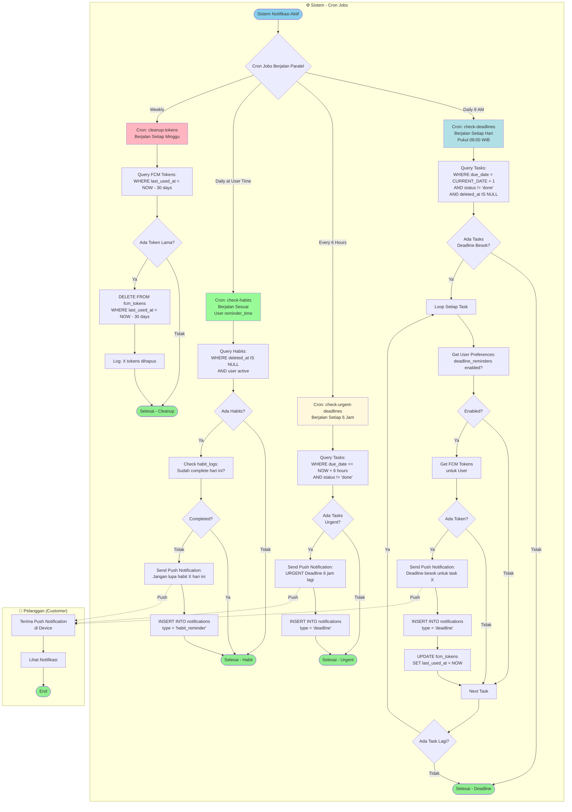

**Penjelasan:**
- **Role Sistem (Cron Jobs)**: 4 cron jobs berjalan paralel untuk automated notifications
- **Role User (Pelanggan)**: Menerima push notification di device
- **Deadline Notification**: Cek tasks yang deadline besok, kirim notif pukul 8 pagi
- **Urgent Deadline**: Cek tasks yang deadline dalam 6 jam, kirim notif setiap 6 jam
- **Habit Reminder**: Cek habits yang belum complete hari ini, kirim sesuai user's reminder_time
- **Token Cleanup**: Hapus FCM tokens yang tidak digunakan >30 hari (weekly)
- Semua notifikasi cek user preferences terlebih dahulu
- History disimpan di tabel `notifications`

---

## 9. Activity Diagram: Enable Push Notifications

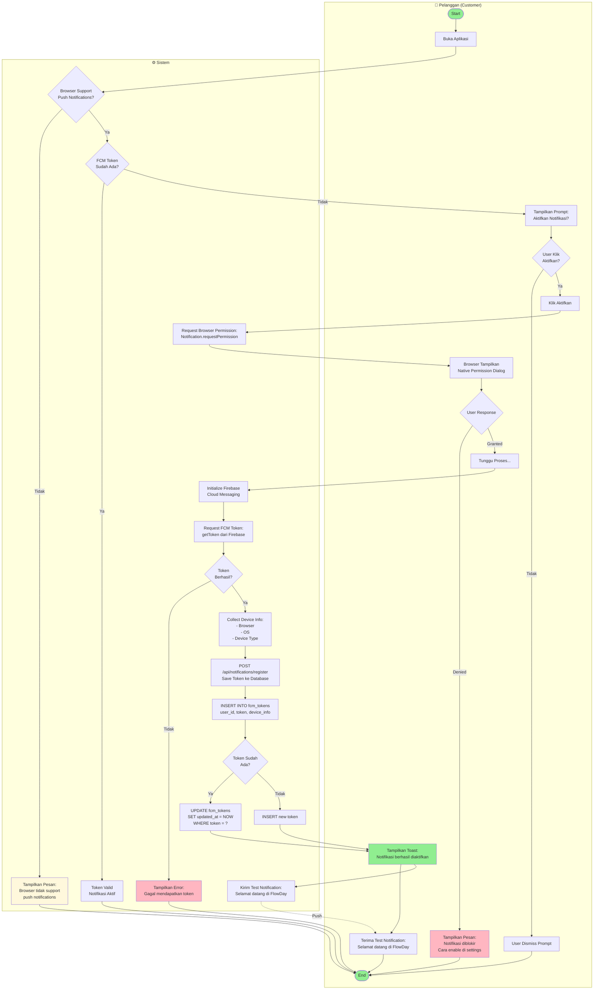

**Penjelasan:**
- **Role User (Pelanggan/Customer)**: Buka app, klik aktifkan notifikasi, izinkan permission browser, terima test notification
- **Role Sistem**: Cek browser support, cek existing token, request permission, init Firebase, get FCM token, save to database
1. **Check Browser Support**: Validasi browser support push notifications
2. **Check Existing Token**: Cek apakah user sudah punya FCM token aktif
3. **Request Permission**: Tampilkan prompt untuk aktifkan notifikasi
4. **Browser Permission**: Native browser dialog untuk izin notifikasi
5. **Get FCM Token**: Request token dari Firebase Cloud Messaging
6. **Save to Database**: Simpan token ke tabel `fcm_tokens` dengan device info
7. **Handle Duplicate**: Update jika token sudah ada, insert jika baru
8. **Test Notification**: Kirim welcome notification untuk konfirmasi

---

## 10. Activity Diagram: Send Deadline Notification (Cron)

```mermaid
graph TD
    subgraph System["⚙️ Sistem - Cron Job"]
        Start([Cron Job Triggered<br/>Daily at 8:00 AM WIB]) --> LogStart[Log: Cron job started]
        LogStart --> QueryTasks[Query Database:<br/>SELECT * FROM tasks<br/>WHERE due_date = CURRENT_DATE + INTERVAL '1 day'<br/>AND status != 'done'<br/>AND deleted_at IS NULL]
        QueryTasks --> CheckResults{Ada Tasks<br/>yang Deadline<br/>Besok?}
        
        CheckResults -->|Tidak| LogNoTasks[Log: No tasks found]
        LogNoTasks --> EndSuccess([Cron Selesai - Success])
        
        CheckResults -->|Ya| GroupByUser[GROUP BY user_id<br/>untuk Batch Processing]
        GroupByUser --> LoopUsers[Loop Setiap User]
        
        LoopUsers --> GetPreferences[Query Preferences:<br/>SELECT * FROM notification_preferences<br/>WHERE user_id = ?]
        GetPreferences --> CheckEnabled{deadline_reminders<br/>= TRUE?}
        
        CheckEnabled -->|Tidak| LogDisabled[Log: User disabled deadline reminders]
        LogDisabled --> NextUser[Next User]
        
        CheckEnabled -->|Ya| GetTokens[Query FCM Tokens:<br/>SELECT * FROM fcm_tokens<br/>WHERE user_id = ?<br/>AND last_used_at > NOW - 30 days]
        GetTokens --> CheckTokens{Ada Token<br/>Aktif?}
        
        CheckTokens -->|Tidak| LogNoToken[Log: No active tokens for user]
        LogNoToken --> NextUser
        
        CheckTokens -->|Ya| PrepareNotif[Prepare Notification Payload:<br/>title: Pengingat Deadline<br/>body: X tugas deadline besok<br/>data: task_ids, user_id]
        PrepareNotif --> LoopTokens[Loop Setiap Token]
        
        LoopTokens --> SendFCM[Send via Firebase Admin SDK:<br/>admin.messaging.send]
        SendFCM --> FCMResponse{FCM Response}
        
        FCMResponse -->|Success| LogSuccess[Log: Notification sent successfully]
        LogSuccess --> SaveHistory[INSERT INTO notifications<br/>user_id, title, body, type='deadline']
        SaveHistory --> UpdateToken[UPDATE fcm_tokens<br/>SET last_used_at = NOW<br/>WHERE token = ?]
        UpdateToken --> NextToken[Next Token]
        
        FCMResponse -->|Error: Invalid Token| LogInvalidToken[Log: Invalid token]
        LogInvalidToken --> DeleteToken[DELETE FROM fcm_tokens<br/>WHERE token = ?]
        DeleteToken --> NextToken
        
        FCMResponse -->|Error: Other| LogError[Log: FCM error]
        LogError --> NextToken
        
        NextToken --> CheckMoreTokens{Ada Token<br/>Lagi?}
        CheckMoreTokens -->|Ya| LoopTokens
        CheckMoreTokens -->|Tidak| NextUser
        
        NextUser --> CheckMoreUsers{Ada User<br/>Lagi?}
        CheckMoreUsers -->|Ya| LoopUsers
        CheckMoreUsers -->|Tidak| LogComplete[Log: Cron job completed<br/>X notifications sent]
        LogComplete --> EndSuccess
    end
    
    subgraph User["👤 Pelanggan (Customer)"]
        ReceiveNotif[Terima Push Notification<br/>di Device]
        ReceiveNotif --> ViewNotif[Lihat Notifikasi<br/>Deadline]
        ViewNotif --> EndUser([End])
    end
    
    SendFCM -.->|Push| ReceiveNotif

    style Start fill:#87CEEB
    style EndSuccess fill:#90EE90
    style EndUser fill:#90EE90
    style LogSuccess fill:#90EE90
    style LogError fill:#FFB6C1
    style LogInvalidToken fill:#FFF8DC
``` detected]
    LogInvalidToken --> DeleteToken[DELETE FROM fcm_tokens<br/>WHERE token = ?]
    DeleteToken --> NextToken
    
    FCMResponse -->|Error: Other| LogError[Log: FCM error]
    LogError --> NextToken
    
    NextToken --> CheckMoreTokens{Ada Token<br/>Lagi?}
    CheckMoreTokens -->|Ya| LoopTokens
    CheckMoreTokens -->|Tidak| NextUser
    
    NextUser --> CheckMoreUsers{Ada User<br/>Lagi?}
    CheckMoreUsers -->|Ya| LoopUsers
    CheckMoreUsers -->|Tidak| LogComplete[Log: Cron job completed<br/>X notifications sent]
    LogComplete --> EndSuccess

    style Start fill:#e1f5e1
    style EndSuccess fill:#e1f5e1
    style LogSuccess fill:#e1f5e1
    style LogError fill:#ffe1e1
    style LogInvalidToken fill:#fff3cd
```

**Penjelasan Cron Job Flow:**
- **Role Sistem (Cron Job)**: Triggered daily 8 AM, query tasks, loop users, cek preferences, send FCM, handle response
- **Role User (Pelanggan)**: Terima push notification di device
1. **Trigger**: Cron job berjalan setiap hari pukul 8 pagi (via Vercel Cron)
2. **Query Tasks**: Ambil semua tasks yang deadline besok dan belum selesai
3. **Group by User**: Batch processing per user untuk efisiensi
4. **Check Preferences**: Validasi user enable deadline reminders
5. **Get Tokens**: Ambil FCM tokens yang aktif (digunakan <30 hari terakhir)
6. **Send Notification**: Kirim via Firebase Admin SDK
7. **Handle Response**:
   - Success: Save history, update last_used_at
   - Invalid Token: Delete token dari database
   - Other Error: Log error untuk debugging
8. **Logging**: Comprehensive logging untuk monitoring

---

## 11. Activity Diagram: Configure Notification Preferences

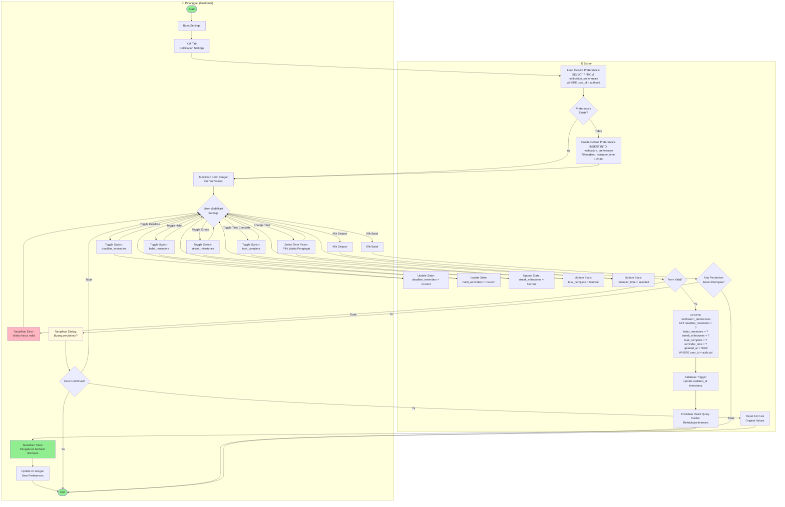

**Penjelasan:**
- **Role User (Pelanggan/Customer)**: Buka settings, klik notification tab, toggle switches, ubah waktu, simpan atau batal
- **Role Sistem**: Load preferences, create default jika belum ada, update state, validasi form, save to database, invalidate cache
1. **Load Preferences**: Ambil current preferences dari database
2. **Create Default**: Jika belum ada, create dengan default values (all enabled, 8 PM)
3. **Toggle Switches**: User bisa enable/disable per notification type:
   - Deadline Reminders
   - Habit Reminders
   - Streak Milestones
   - Task Complete
4. **Change Time**: User bisa set custom reminder time untuk habit reminders
5. **Save to Database**: Update preferences dengan RLS filter
6. **Invalidate Cache**: React Query refetch untuk update UI
7. **Cancel Handling**: Konfirmasi jika ada unsaved changes

---

## 12. Activity Diagram: Complete System Flow

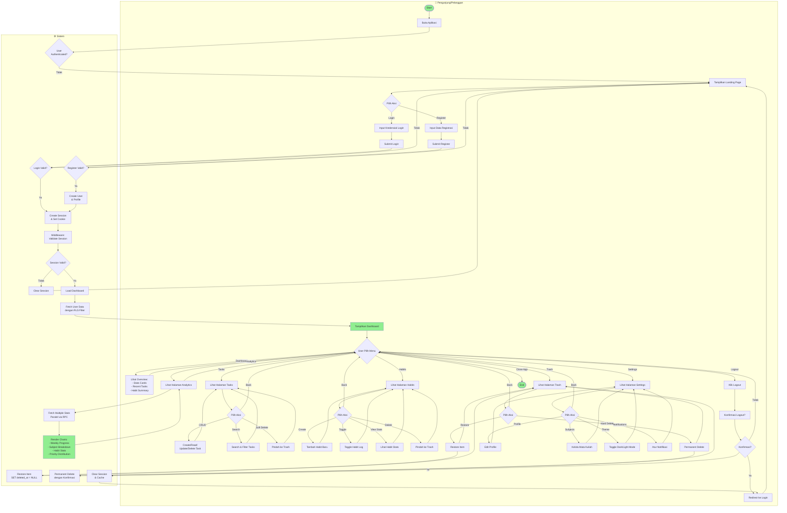

**Penjelasan Complete Flow:**
- **Role User (Pengunjung/Pelanggan)**: Buka app, login/register, navigasi menu, pilih aksi di setiap halaman, logout
- **Role Sistem**: Cek authentication, validasi login/register, middleware session, fetch data dengan RLS, operasi database
1. **Authentication Check**: Middleware validasi session
2. **Landing/Auth**: Login atau register untuk user baru
3. **Dashboard**: Overview stats dan recent activities
4. **Tasks Management**: CRUD, search, filter, soft delete
5. **Habits Management**: Create, toggle, view stats, soft delete
6. **Analytics**: Multiple RPC queries untuk charts dan stats
7. **Trash**: Restore atau permanent delete items
8. **Settings**: Edit profile, manage subjects, toggle theme, notification preferences
9. **Logout**: Clear session dan redirect ke login

---

## 📝 CATATAN FORMAT DIAGRAM

### Role-Based Activity Diagrams (Swimlanes)

Semua activity diagram dalam dokumen ini menggunakan format **role-based** dengan **swimlanes** untuk memisahkan tanggung jawab antara:

1. **👤 Pengunjung (Guest)** - User yang belum login
2. **👤 Pelanggan (Customer)** - User yang sudah login
3. **⚙️ Sistem** - Backend system, database, API, cron jobs

### Keuntungan Format Role-Based:

- ✅ **Pemisahan Tanggung Jawab yang Jelas**: Mudah melihat siapa yang melakukan apa
- ✅ **Identifikasi Interaksi**: Jelas terlihat komunikasi antara user dan sistem
- ✅ **Debugging Lebih Mudah**: Cepat menemukan di mana masalah terjadi (client-side vs server-side)
- ✅ **Dokumentasi Lebih Baik**: Memudahkan developer baru memahami flow aplikasi
- ✅ **Sesuai Standar UML**: Mengikuti best practice activity diagram dengan swimlanes

### Konvensi Warna:

- 🟢 **Hijau (#90EE90)**: Start, End, Success states
- 🔴 **Merah Muda (#FFB6C1)**: Error states, Failed operations
- 🟡 **Kuning Muda (#FFF8DC)**: Warning, Confirmation dialogs
- 🔵 **Biru Muda (#87CEEB, #B0E0E6)**: System processes, Cron jobs

### Simbol Koneksi:

- **→ (Solid Arrow)**: Alur normal/synchronous
- **-.-> (Dashed Arrow)**: Alur asynchronous (contoh: push notification)

---

**Last Updated**: 2026-05-06  
**Version**: 2.0 (Role-Based Format)  
**Author**: FlowDay Development Team
