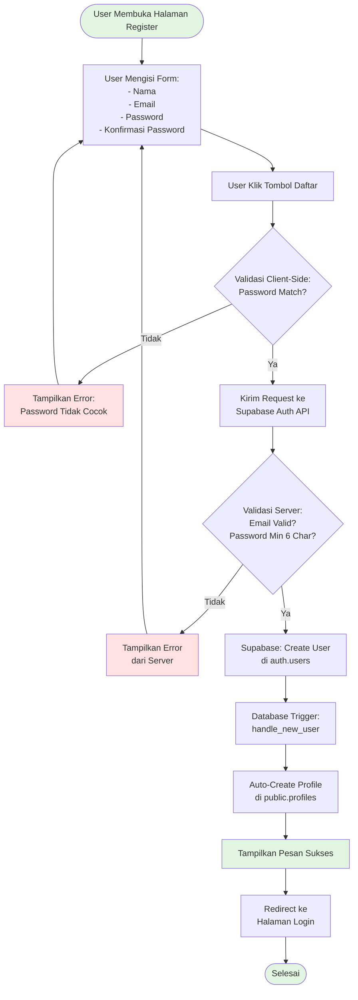
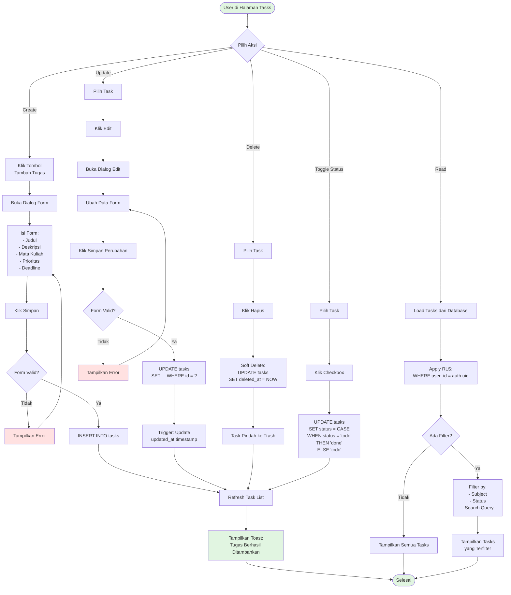
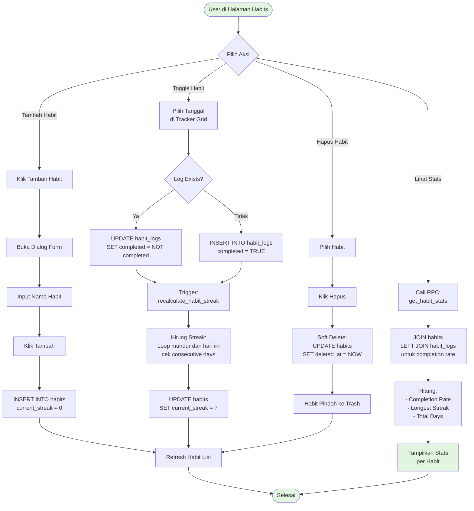
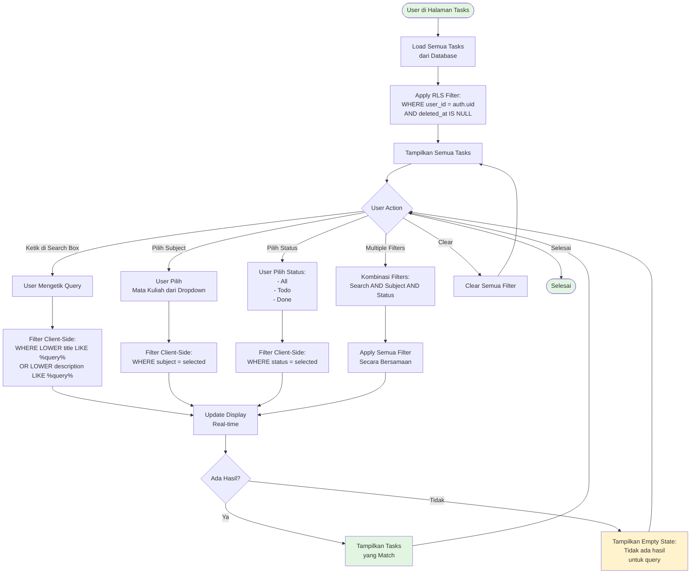
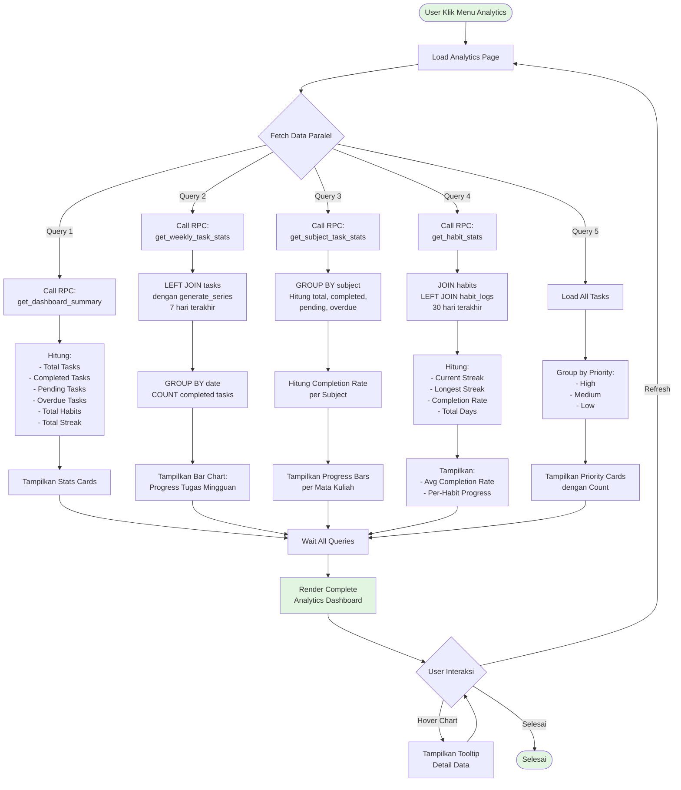
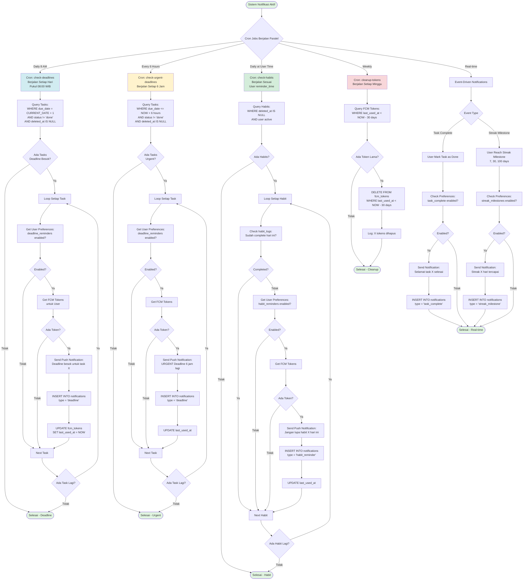
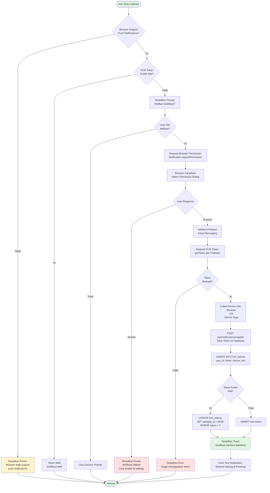
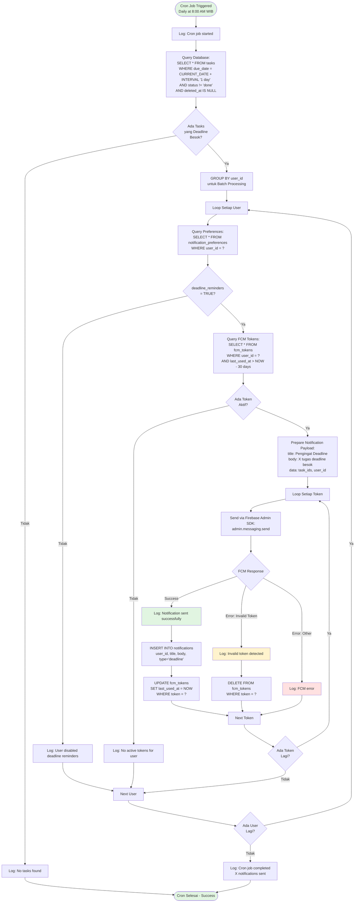
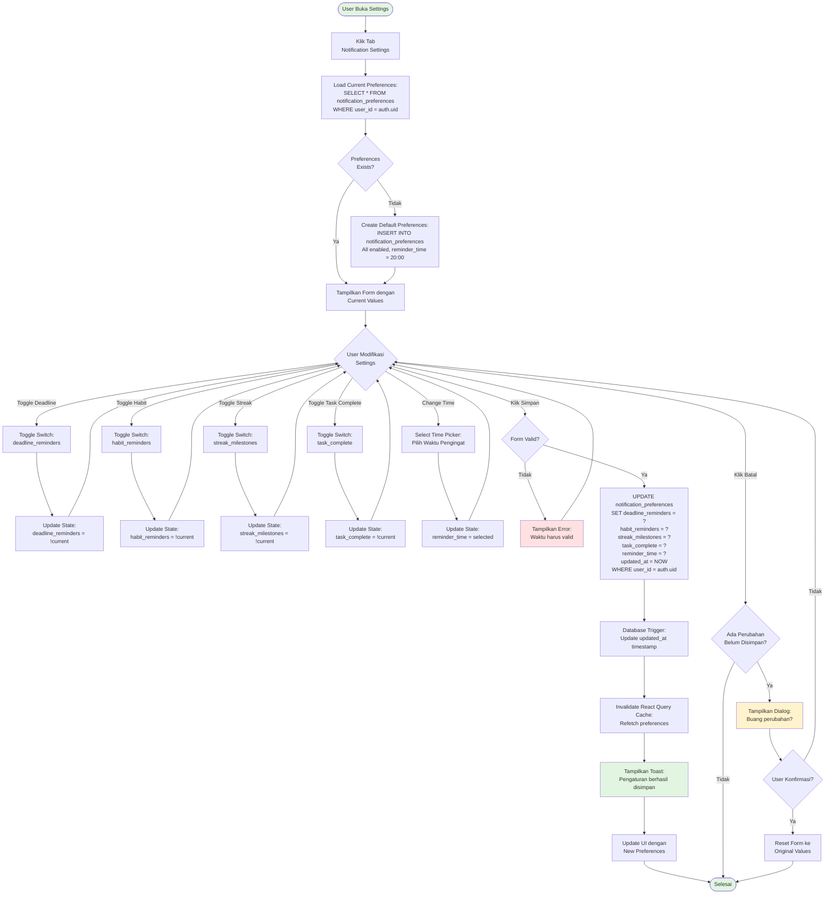
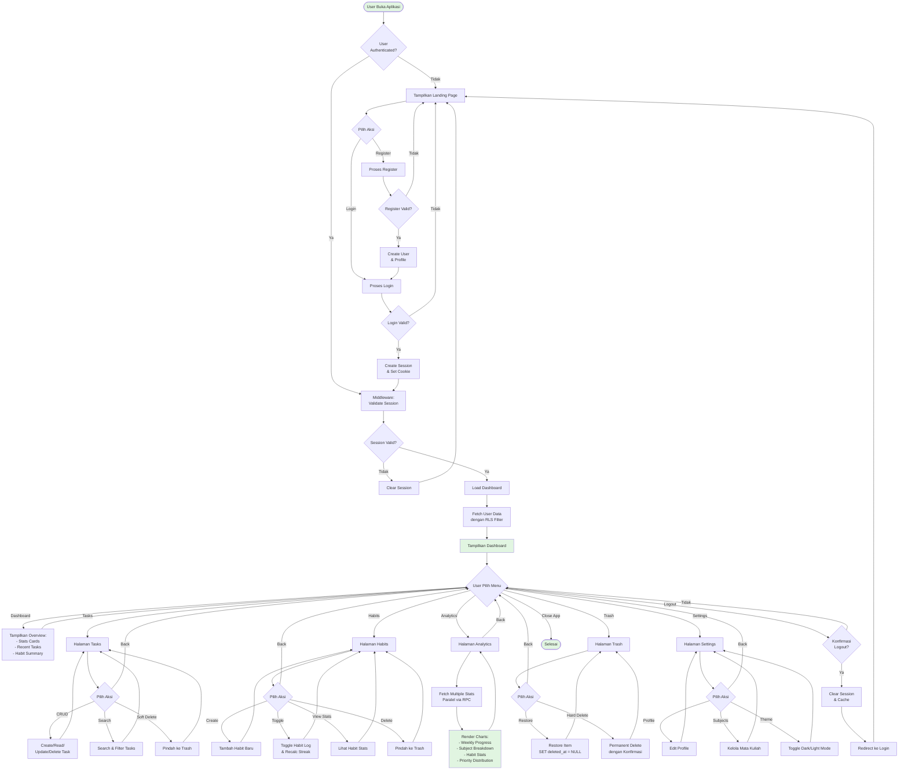

# ACTIVITY DIAGRAMS - FlowDay Project
# Task & Habit Management System

---

## 📋 DAFTAR ISI

1. [Activity Diagram: User Registration](#1-activity-diagram-user-registration)
2. [Activity Diagram: User Login](#2-activity-diagram-user-login)
3. [Activity Diagram: Manage Tasks (CRUD)](#3-activity-diagram-manage-tasks-crud)
4. [Activity Diagram: Manage Habits](#4-activity-diagram-manage-habits)
5. [Activity Diagram: Soft Delete & Hard Delete](#5-activity-diagram-soft-delete--hard-delete)
6. [Activity Diagram: Search & Filter Tasks](#6-activity-diagram-search--filter-tasks)
7. [Activity Diagram: View Analytics](#7-activity-diagram-view-analytics)
8. [Activity Diagram: Notification System](#8-activity-diagram-notification-system) 
9. [Activity Diagram: Enable Push Notifications](#9-activity-diagram-enable-push-notifications) 
10. [Activity Diagram: Send Deadline Notification (Cron)](#10-activity-diagram-send-deadline-notification-cron) 
11. [Activity Diagram: Configure Notification Preferences](#11-activity-diagram-configure-notification-preferences) 
12. [Activity Diagram: Complete System Flow](#12-activity-diagram-complete-system-flow)

---

## 1. Activity Diagram: User Registration

**Penjelasan:**
- User mengisi form registrasi dengan nama, email, password, dan konfirmasi password
- Validasi client-side memastikan password dan konfirmasi password cocok
- Request dikirim ke Supabase Auth API
- Server memvalidasi email dan password (min 6 karakter)
- Jika valid, user dibuat di tabel `auth.users`
- Database trigger `handle_new_user` otomatis membuat profile di `public.profiles`
- User diarahkan ke halaman login

---

## 2. Activity Diagram: User Login

**Penjelasan:**
- User memasukkan email dan password
- Kredensial divalidasi oleh Supabase Auth
- Jika valid, session dibuat dan cookie di-set
- Middleware memvalidasi session sebelum akses dashboard
- Row Level Security (RLS) memastikan user hanya melihat data miliknya
- Dashboard ditampilkan dengan data user yang sudah terfilter

---

## 3. Activity Diagram: Manage Tasks (CRUD)

**Penjelasan:**
- **CREATE**: User mengisi form dan data di-insert ke database
- **READ**: Tasks di-load dengan RLS filter, bisa ditambah filter subject/status/search
- **UPDATE**: User edit task, data di-update dengan trigger auto-update timestamp
- **DELETE**: Soft delete dengan set `deleted_at`, task pindah ke trash
- **TOGGLE**: Checkbox untuk toggle status todo/done

---

## 4. Activity Diagram: Manage Habits

**Penjelasan:**
- **CREATE**: User membuat habit baru dengan nama, initial streak = 0
- **TOGGLE**: User centang/uncentang habit di tracker grid
  - Jika log belum ada, insert baru
  - Jika sudah ada, toggle completed status
  - Trigger otomatis recalculate streak
- **STATS**: RPC function join habits dengan habit_logs untuk hitung completion rate
- **DELETE**: Soft delete habit ke trash

---

## 5. Activity Diagram: Soft Delete & Hard Delete

**Penjelasan:**
- **SOFT DELETE**: 
  - Set `deleted_at = NOW()`
  - Item hilang dari halaman utama
  - Item muncul di trash
  - Data masih ada di database
  
- **RESTORE**:
  - Set `deleted_at = NULL`
  - Item kembali ke halaman utama
  - Reversible action
  
- **HARD DELETE**:
  - Tampilkan konfirmasi dialog
  - DELETE FROM database
  - Cascade delete untuk related records (habit_logs)
  - Irreversible action

---

## 6. Activity Diagram: Search & Filter Tasks

**Penjelasan:**
- Tasks di-load dari database dengan RLS filter
- **Search**: Real-time filter berdasarkan title atau description (case-insensitive)
- **Filter Subject**: Filter berdasarkan mata kuliah yang dipilih
- **Filter Status**: Filter berdasarkan status (todo/done)
- **Combined**: Semua filter bisa dikombinasikan
- Filter dilakukan di client-side menggunakan `useMemo` untuk performa optimal
- Empty state ditampilkan jika tidak ada hasil

---

## 7. Activity Diagram: View Analytics

**Penjelasan:**
- Analytics page melakukan **5 query paralel** untuk performa optimal
- **Dashboard Summary**: Agregasi total tasks, habits, streak
- **Weekly Stats**: JOIN tasks dengan generate_series untuk 7 hari terakhir, tampil di bar chart
- **Subject Stats**: GROUP BY subject untuk breakdown per mata kuliah
- **Habit Stats**: JOIN habits dengan habit_logs untuk hitung completion rate 30 hari
- **Priority Breakdown**: Group tasks by priority (high/medium/low)
- Semua query menggunakan RLS untuk filter user_id
- React Query melakukan caching untuk performa

---

## 8. Activity Diagram: Notification System

**Penjelasan:**
- **4 Cron Jobs** berjalan paralel untuk automated notifications
- **Deadline Notification**: Cek tasks yang deadline besok, kirim notif pukul 8 pagi
- **Urgent Deadline**: Cek tasks yang deadline dalam 6 jam, kirim notif setiap 6 jam
- **Habit Reminder**: Cek habits yang belum complete hari ini, kirim sesuai user's reminder_time
- **Token Cleanup**: Hapus FCM tokens yang tidak digunakan >30 hari (weekly)
- **Real-time Notifications**: Event-driven untuk task complete dan streak milestone
- Semua notifikasi cek user preferences terlebih dahulu
- History disimpan di tabel `notifications`

---

## 9. Activity Diagram: Enable Push Notifications

**Penjelasan:**
1. **Check Browser Support**: Validasi browser support push notifications
2. **Check Existing Token**: Cek apakah user sudah punya FCM token aktif
3. **Request Permission**: Tampilkan prompt untuk aktifkan notifikasi
4. **Browser Permission**: Native browser dialog untuk izin notifikasi
5. **Get FCM Token**: Request token dari Firebase Cloud Messaging
6. **Save to Database**: Simpan token ke tabel `fcm_tokens` dengan device info
7. **Handle Duplicate**: Update jika token sudah ada, insert jika baru
8. **Test Notification**: Kirim welcome notification untuk konfirmasi

---

## 10. Activity Diagram: Send Deadline Notification (Cron)

**Penjelasan Cron Job Flow:**
1. **Trigger**: Cron job berjalan setiap hari pukul 8 pagi (via Vercel Cron)
2. **Query Tasks**: Ambil semua tasks yang deadline besok dan belum selesai
3. **Group by User**: Batch processing per user untuk efisiensi
4. **Check Preferences**: Validasi user enable deadline reminders
5. **Get Tokens**: Ambil FCM tokens yang aktif (digunakan <30 hari terakhir)
6. **Send Notification**: Kirim via Firebase Admin SDK
7. **Handle Response**:
   - Success: Save history, update last_used_at
   - Invalid Token: Delete token dari database
   - Other Error: Log error untuk debugging
8. **Logging**: Comprehensive logging untuk monitoring

---

## 11. Activity Diagram: Configure Notification Preferences

**Penjelasan:**
1. **Load Preferences**: Ambil current preferences dari database
2. **Create Default**: Jika belum ada, create dengan default values (all enabled, 8 PM)
3. **Toggle Switches**: User bisa enable/disable per notification type:
   - Deadline Reminders
   - Habit Reminders
   - Streak Milestones
   - Task Complete
4. **Change Time**: User bisa set custom reminder time untuk habit reminders
5. **Save to Database**: Update preferences dengan RLS filter
6. **Invalidate Cache**: React Query refetch untuk update UI
7. **Cancel Handling**: Konfirmasi jika ada unsaved changes

---

## 12. Activity Diagram: Complete System Flow

**Penjelasan Complete Flow:**
1. **Authentication Check**: Middleware validasi session
2. **Landing/Auth**: Login atau register untuk user baru
3. **Dashboard**: Overview stats dan recent activities
4. **Tasks Management**: CRUD, search, filter, soft delete
5. **Habits Management**: Create, toggle, view stats, soft delete
6. **Analytics**: Multiple RPC queries untuk charts dan stats
7. **Trash**: Restore atau permanent delete items
8. **Settings**: Edit profile, manage subjects, toggle theme
9. **Logout**: Clear session dan redirect ke login

---
