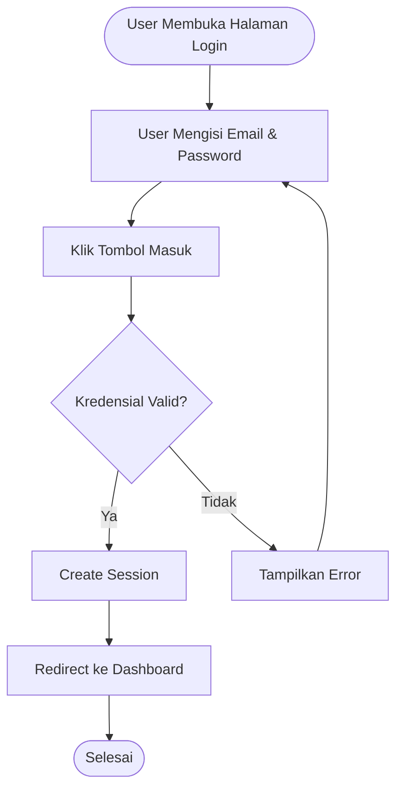
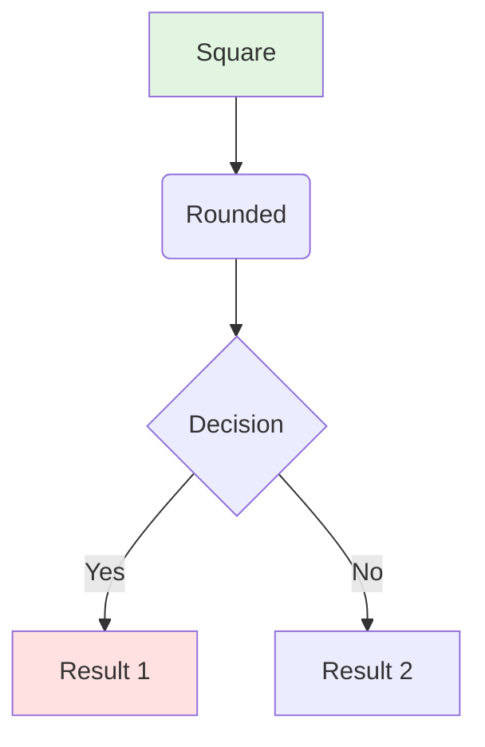

# 📖 CARA MENGGUNAKAN ACTIVITY DIAGRAMS DI GITHUB

## 🎯 Panduan Lengkap untuk FlowDay Project

---

## 1️⃣ CARA PALING MUDAH: Push ke GitHub

### Langkah-langkah:

#### Step 1: Pastikan File Sudah Ada
```bash
# Cek apakah file ACTIVITY_DIAGRAMS.md sudah ada
ls -la ACTIVITY_DIAGRAMS.md
```

#### Step 2: Add, Commit, dan Push ke GitHub
```bash
# Add file ke git
git add ACTIVITY_DIAGRAMS.md

# Commit dengan pesan yang jelas
git commit -m "docs: add activity diagrams for system flows"

# Push ke GitHub
git push origin main
```

#### Step 3: Buka di GitHub
1. Buka repository kamu di GitHub
2. Klik file `ACTIVITY_DIAGRAMS.md`
3. **Diagram akan otomatis ter-render!** ✨

### ✅ Keuntungan Metode Ini:
- ✅ Otomatis ter-render tanpa setup tambahan
- ✅ Bisa dilihat langsung di browser
- ✅ Bisa di-share via link
- ✅ Mendukung dark/light mode
- ✅ Responsive di mobile

---

## 2️⃣ CARA MEMBUAT README dengan Diagram

Jika kamu ingin diagram muncul di halaman utama repository:

### Buat atau Edit README.md

```markdown
# FlowDay - Task & Habit Management System

## 📊 Activity Diagrams

### User Login Flow


Untuk diagram lengkap, lihat [ACTIVITY_DIAGRAMS.md](./ACTIVITY_DIAGRAMS.md)
```

### Push ke GitHub
```bash
git add README.md
git commit -m "docs: add activity diagram to README"
git push origin main
```

---

## 3️⃣ CARA EXPORT DIAGRAM ke GAMBAR (PNG/SVG)

Jika kamu perlu gambar untuk presentasi PowerPoint/PDF:

### Metode A: Menggunakan Mermaid Live Editor

1. **Buka**: https://mermaid.live
2. **Copy-paste** kode diagram dari `ACTIVITY_DIAGRAMS.md`
3. **Klik "Actions"** di pojok kanan atas
4. **Pilih format**:
   - PNG (untuk PowerPoint)
   - SVG (untuk kualitas terbaik)
   - PDF (untuk dokumen)
5. **Download** dan gunakan di presentasi

### Metode B: Screenshot dari GitHub

1. Buka diagram di GitHub
2. Zoom ke ukuran yang pas
3. Screenshot (Windows: Win+Shift+S, Mac: Cmd+Shift+4)
4. Crop dan save

### Metode C: Menggunakan VS Code Extension

1. Install extension: **"Markdown Preview Mermaid Support"**
2. Buka `ACTIVITY_DIAGRAMS.md` di VS Code
3. Klik "Open Preview" (Ctrl+Shift+V)
4. Right-click pada diagram → "Copy Image"
5. Paste ke PowerPoint/Word

---

## 4️⃣ CARA EDIT DIAGRAM

### Edit di VS Code (Recommended)

1. **Install Extension**:
   - Buka VS Code
   - Extensions (Ctrl+Shift+X)
   - Cari: "Markdown Preview Mermaid Support"
   - Install

2. **Edit dengan Live Preview**:
   ```bash
   # Buka file
   code ACTIVITY_DIAGRAMS.md
   ```
   - Tekan `Ctrl+K V` untuk split preview
   - Edit kode di kiri, lihat hasil di kanan
   - Auto-refresh saat save

3. **Push Changes**:
   ```bash
   git add ACTIVITY_DIAGRAMS.md
   git commit -m "docs: update activity diagrams"
   git push origin main
   ```

### Edit Online di GitHub

1. Buka file di GitHub
2. Klik tombol **Edit** (ikon pensil)
3. Edit kode Mermaid
4. Klik **Preview** untuk lihat hasil
5. Scroll ke bawah, isi commit message
6. Klik **Commit changes**

---

## 5️⃣ CARA SHARE DIAGRAM

### Metode A: Share Link GitHub

```
https://github.com/username/flowday/blob/main/ACTIVITY_DIAGRAMS.md
```

Ganti `username` dan `flowday` dengan repository kamu.

### Metode B: Share Specific Diagram

1. Buka file di GitHub
2. Klik heading diagram yang ingin di-share (misal: "Activity Diagram: User Login")
3. Copy URL dari address bar (akan ada `#` anchor)
4. Share link tersebut

Contoh:
```
https://github.com/username/flowday/blob/main/ACTIVITY_DIAGRAMS.md#2-activity-diagram-user-login
```

### Metode C: Embed di Website/Blog

Jika kamu punya website/blog, bisa embed diagram:

```html
<iframe 
  src="https://mermaid.ink/img/[encoded-diagram]" 
  width="100%" 
  height="600">
</iframe>
```

---

## 6️⃣ TIPS & TRICKS

### Tip 1: Gunakan GitHub Gist untuk Quick Share

1. Buka https://gist.github.com
2. Paste kode diagram
3. Nama file: `diagram.md` (harus .md)
4. Create public gist
5. Share link gist

### Tip 2: Tambahkan ke GitHub Wiki

1. Buka tab **Wiki** di repository
2. Create new page: "Activity Diagrams"
3. Paste kode Mermaid
4. Save page
5. Diagram akan ter-render di Wiki

### Tip 3: Gunakan GitHub Pages

Jika kamu punya GitHub Pages:

1. Buat folder `docs/`
2. Copy `ACTIVITY_DIAGRAMS.md` ke `docs/`
3. Enable GitHub Pages di Settings
4. Akses via: `https://username.github.io/flowday/ACTIVITY_DIAGRAMS`

### Tip 4: Dark Mode Support

Diagram Mermaid di GitHub otomatis support dark mode! 
Warna akan adjust sesuai theme user.

---

## 7️⃣ TROUBLESHOOTING

### ❌ Diagram Tidak Muncul di GitHub

**Penyebab**: Syntax error di kode Mermaid

**Solusi**:
1. Cek di https://mermaid.live untuk validasi syntax
2. Pastikan ada backticks (```) sebelum dan sesudah kode
3. Pastikan ada keyword `mermaid` setelah backticks pertama

```markdown
✅ BENAR:


❌ SALAH:
```
graph TD
    A --> B
```
```

### ❌ Diagram Terlalu Kecil/Besar

**Solusi**: Adjust di Mermaid Live Editor, lalu export sebagai gambar dengan ukuran custom.

### ❌ Diagram Tidak Update Setelah Push

**Solusi**: 
1. Hard refresh browser (Ctrl+Shift+R)
2. Clear cache
3. Tunggu beberapa detik (GitHub perlu render)

---

## 8️⃣ CONTOH PENGGUNAAN UNTUK PRESENTASI

### Untuk Presentasi Tugas Akhir:

#### Slide 1: Overview
```markdown
# FlowDay - System Architecture

Lihat diagram lengkap di: 
[GitHub Repository](https://github.com/username/flowday)
```

#### Slide 2: User Flow
- Screenshot diagram "User Login" dari GitHub
- Paste ke PowerPoint
- Tambahkan penjelasan

#### Slide 3: CRUD Operations
- Screenshot diagram "Manage Tasks"
- Highlight bagian Create, Read, Update, Delete

#### Slide 4: Database Operations
- Screenshot diagram "Soft Delete & Hard Delete"
- Jelaskan perbedaan soft vs hard delete

---

## 9️⃣ CHECKLIST SEBELUM PRESENTASI

- [ ] File `ACTIVITY_DIAGRAMS.md` sudah di-push ke GitHub
- [ ] Semua diagram ter-render dengan benar di GitHub
- [ ] Link repository sudah di-test dan bisa diakses
- [ ] Screenshot diagram sudah di-export untuk backup
- [ ] README.md sudah include link ke activity diagrams
- [ ] Sudah test buka di browser lain (Chrome, Firefox, Edge)
- [ ] Sudah test buka di mobile (untuk jaga-jaga)

---

## 🔟 BONUS: Template Commit Messages

Untuk dokumentasi yang rapi:

```bash
# Menambah diagram baru
git commit -m "docs: add activity diagrams for system flows"

# Update diagram existing
git commit -m "docs: update user login flow diagram"

# Fix diagram error
git commit -m "fix: correct syntax error in habit management diagram"

# Improve diagram
git commit -m "docs: improve clarity of CRUD operations diagram"
```

---

## 📚 RESOURCES

### Official Documentation:
- **Mermaid Docs**: https://mermaid.js.org/
- **GitHub Markdown**: https://docs.github.com/en/get-started/writing-on-github
- **Mermaid Live Editor**: https://mermaid.live

### Useful Tools:
- **VS Code Extension**: Markdown Preview Mermaid Support
- **Chrome Extension**: Mermaid Diagrams
- **Online Editor**: https://mermaid.live

### Mermaid Syntax Reference:


---

## 🎓 UNTUK DOSEN/PENGUJI

Jika dosen ingin melihat diagram:

1. **Share Link Repository**:
   ```
   https://github.com/username/flowday
   ```

2. **Direct Link ke Diagrams**:
   ```
   https://github.com/username/flowday/blob/main/ACTIVITY_DIAGRAMS.md
   ```

3. **Atau Export PDF**:
   - Buka di GitHub
   - Print page (Ctrl+P)
   - Save as PDF
   - Share PDF file

---

## ✅ QUICK START CHECKLIST

Untuk mulai menggunakan diagram di GitHub:

```bash
# 1. Pastikan file ada
ls ACTIVITY_DIAGRAMS.md

# 2. Add ke git
git add ACTIVITY_DIAGRAMS.md

# 3. Commit
git commit -m "docs: add activity diagrams"

# 4. Push ke GitHub
git push origin main

# 5. Buka di browser
# https://github.com/YOUR_USERNAME/YOUR_REPO/blob/main/ACTIVITY_DIAGRAMS.md
```

**Done!** Diagram akan otomatis ter-render di GitHub! 🎉

---

**Dibuat pada**: 1 Mei 2026  
**Project**: FlowDay - Task & Habit Management System  
**Untuk**: Tugas Akhir Praktikum
