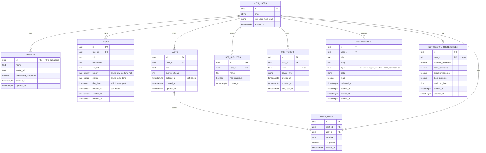

# 📊 Dokumentasi Database FlowDay

## 📋 Daftar Isi
1. [Overview](#overview)
2. [Diagram ERD](#diagram-erd)
3. [Tabel Database](#tabel-database)
4. [Relasi Antar Tabel](#relasi-antar-tabel)
5. [Functions & Stored Procedures](#functions--stored-procedures)
6. [Security & RLS](#security--rls)
7. [Indexes & Performance](#indexes--performance)

---

## Overview

FlowDay menggunakan **Supabase (PostgreSQL)** sebagai database utama dengan arsitektur yang bersih dan terstruktur. Database ini dirancang untuk mendukung:

- ✅ **Task Management** - Manajemen tugas dengan deadline realtime
- ✅ **Habit Tracking** - Pelacakan kebiasaan dengan streak system
- ✅ **Subject Management** - Manajemen mata kuliah per user
- ✅ **Notification System** - Sistem notifikasi push dengan FCM
- ✅ **Analytics & Stats** - Statistik dan analitik performa user
- ✅ **Soft Delete** - Fitur trash/recycle bin untuk tasks dan habits

---

## Diagram ERD



---

## Tabel Database

### 1. **profiles** 👤
**Fungsi:** Menyimpan profil user yang terhubung dengan auth.users

| Kolom | Tipe | Deskripsi |
|-------|------|-----------|
| `id` | UUID (PK) | Foreign key ke auth.users(id) |
| `name` | TEXT | Nama lengkap user |
| `avatar_url` | TEXT | URL foto profil |
| `onboarding_completed` | BOOLEAN | Status onboarding (default: false) |
| `created_at` | TIMESTAMPTZ | Waktu pembuatan |
| `updated_at` | TIMESTAMPTZ | Waktu update terakhir |

**Relasi:**
- `id` → `auth.users(id)` (ON DELETE CASCADE)

**Trigger:**
- Auto-create profile saat user baru signup
- Auto-update `updated_at` saat ada perubahan

---

### 2. **tasks** 📝
**Fungsi:** Menyimpan semua tugas/task user dengan deadline realtime

| Kolom | Tipe | Deskripsi |
|-------|------|-----------|
| `id` | UUID (PK) | Primary key |
| `user_id` | UUID (FK) | Pemilik task |
| `title` | TEXT | Judul task (1-255 karakter) |
| `description` | TEXT | Deskripsi detail task |
| `subject` | TEXT | Mata kuliah terkait |
| `priority` | ENUM | Prioritas: low, medium, high |
| `status` | ENUM | Status: todo, done |
| `due_date` | TIMESTAMPTZ | Deadline dengan waktu (bukan hanya tanggal) |
| `deleted_at` | TIMESTAMPTZ | Soft delete timestamp (NULL = aktif) |
| `created_at` | TIMESTAMPTZ | Waktu pembuatan |
| `updated_at` | TIMESTAMPTZ | Waktu update terakhir |

**Relasi:**
- `user_id` → `auth.users(id)` (ON DELETE CASCADE)

**Fitur Khusus:**
- ✅ **Soft Delete** - Task tidak langsung dihapus, masuk trash dulu
- ✅ **Realtime Countdown** - Deadline dengan jam/menit, bukan hanya tanggal
- ✅ **Subject Filtering** - Filter task berdasarkan mata kuliah

**Functions:**
- `soft_delete_task(task_id)` - Pindahkan ke trash
- `restore_task(task_id)` - Restore dari trash
- `permanent_delete_task(task_id)` - Hapus permanen

---

### 3. **habits** 🎯
**Fungsi:** Menyimpan kebiasaan yang ingin di-track user

| Kolom | Tipe | Deskripsi |
|-------|------|-----------|
| `id` | UUID (PK) | Primary key |
| `user_id` | UUID (FK) | Pemilik habit |
| `title` | TEXT | Nama habit (1-100 karakter) |
| `current_streak` | INT | Streak saat ini (hari berturut-turut) |
| `deleted_at` | TIMESTAMPTZ | Soft delete timestamp |
| `created_at` | TIMESTAMPTZ | Waktu pembuatan |
| `updated_at` | TIMESTAMPTZ | Waktu update terakhir |

**Relasi:**
- `user_id` → `auth.users(id)` (ON DELETE CASCADE)
- `id` → `habit_logs(habit_id)` (ONE-TO-MANY)

**Fitur Khusus:**
- ✅ **Auto-calculate Streak** - Streak otomatis dihitung dari habit_logs
- ✅ **Soft Delete** - Habit bisa di-restore dari trash

**Functions:**
- `recalculate_habit_streak(habit_id)` - Hitung ulang streak
- `soft_delete_habit(habit_id)` - Pindahkan ke trash
- `restore_habit(habit_id)` - Restore dari trash
- `permanent_delete_habit(habit_id)` - Hapus permanen

---

### 4. **habit_logs** 📊
**Fungsi:** Menyimpan log harian untuk setiap habit (completed/not completed)

| Kolom | Tipe | Deskripsi |
|-------|------|-----------|
| `id` | UUID (PK) | Primary key |
| `habit_id` | UUID (FK) | Habit yang di-log |
| `user_id` | UUID (FK) | User yang log |
| `log_date` | DATE | Tanggal log |
| `completed` | BOOLEAN | Status: selesai atau tidak |
| `created_at` | TIMESTAMPTZ | Waktu pembuatan |

**Relasi:**
- `habit_id` → `habits(id)` (ON DELETE CASCADE)
- `user_id` → `auth.users(id)` (ON DELETE CASCADE)

**Constraint:**
- UNIQUE (habit_id, log_date) - Satu habit hanya bisa punya 1 log per hari

**Trigger:**
- Auto-recalculate streak saat log berubah (INSERT/UPDATE/DELETE)

---

### 5. **user_subjects** 📚
**Fungsi:** Menyimpan daftar mata kuliah per user (tidak hardcoded)

| Kolom | Tipe | Deskripsi |
|-------|------|-----------|
| `id` | UUID (PK) | Primary key |
| `user_id` | UUID (FK) | Pemilik subject |
| `name` | TEXT | Nama mata kuliah (1-100 karakter) |
| `has_practicum` | BOOLEAN | Apakah ada praktikum (default: false) |
| `created_at` | TIMESTAMPTZ | Waktu pembuatan |

**Relasi:**
- `user_id` → `auth.users(id)` (ON DELETE CASCADE)

**Constraint:**
- UNIQUE (user_id, name) - User tidak bisa punya mata kuliah dengan nama sama

**Fitur Khusus:**
- ✅ **Per-User Isolation** - Setiap user punya daftar mata kuliah sendiri
- ✅ **Practicum Support** - Bisa tandai mata kuliah yang ada praktikum

---

### 6. **fcm_tokens** 🔔
**Fungsi:** Menyimpan Firebase Cloud Messaging tokens untuk push notifications

| Kolom | Tipe | Deskripsi |
|-------|------|-----------|
| `id` | UUID (PK) | Primary key |
| `user_id` | UUID (FK) | Pemilik token |
| `token` | TEXT | FCM token (unique) |
| `device_info` | JSONB | Info device (browser, OS, dll) |
| `created_at` | TIMESTAMPTZ | Waktu pembuatan |
| `updated_at` | TIMESTAMPTZ | Waktu update terakhir |
| `last_used_at` | TIMESTAMPTZ | Terakhir digunakan |

**Relasi:**
- `user_id` → `auth.users(id)` (ON DELETE CASCADE)

**Constraint:**
- UNIQUE (token) - Satu token hanya untuk satu device

**Fitur Khusus:**
- ✅ **Multi-Device Support** - User bisa punya banyak token (multi-device)
- ✅ **Token Cleanup** - Token lama bisa dibersihkan otomatis

---

### 7. **notifications** 📬
**Fungsi:** Menyimpan history notifikasi yang dikirim ke user

| Kolom | Tipe | Deskripsi |
|-------|------|-----------|
| `id` | UUID (PK) | Primary key |
| `user_id` | UUID (FK) | Penerima notifikasi |
| `title` | TEXT | Judul notifikasi |
| `body` | TEXT | Isi notifikasi |
| `type` | TEXT | Tipe: deadline, urgent_deadline, habit_reminder, streak_milestone, task_complete |
| `data` | JSONB | Data tambahan (task_id, habit_id, dll) |
| `read` | BOOLEAN | Status baca (default: false) |
| `delivered_at` | TIMESTAMPTZ | Waktu terkirim |
| `opened_at` | TIMESTAMPTZ | Waktu dibuka |
| `clicked_at` | TIMESTAMPTZ | Waktu di-klik |
| `created_at` | TIMESTAMPTZ | Waktu pembuatan |

**Relasi:**
- `user_id` → `auth.users(id)` (ON DELETE CASCADE)

**Tipe Notifikasi:**
- `deadline` - Reminder H-1 sebelum deadline
- `urgent_deadline` - Reminder 2 jam sebelum deadline
- `habit_reminder` - Reminder harian untuk habit
- `streak_milestone` - Notifikasi milestone streak (7, 30, 100 hari)
- `task_complete` - Notifikasi saat task selesai

**Fitur Khusus:**
- ✅ **Analytics Tracking** - Track delivery, open, click rate
- ✅ **Read Status** - Tandai notifikasi sudah dibaca

---

### 8. **notification_preferences** ⚙️
**Fungsi:** Menyimpan preferensi notifikasi per user

| Kolom | Tipe | Deskripsi |
|-------|------|-----------|
| `id` | UUID (PK) | Primary key |
| `user_id` | UUID (FK) | Pemilik preferensi (unique) |
| `deadline_reminders` | BOOLEAN | Aktifkan reminder deadline (default: true) |
| `habit_reminders` | BOOLEAN | Aktifkan reminder habit (default: true) |
| `streak_milestones` | BOOLEAN | Aktifkan notif milestone (default: true) |
| `task_complete` | BOOLEAN | Aktifkan notif task selesai (default: true) |
| `reminder_time` | TIME | Jam reminder habit (default: 20:00) |
| `created_at` | TIMESTAMPTZ | Waktu pembuatan |
| `updated_at` | TIMESTAMPTZ | Waktu update terakhir |

**Relasi:**
- `user_id` → `auth.users(id)` (ON DELETE CASCADE)

**Constraint:**
- UNIQUE (user_id) - Satu user hanya punya satu set preferensi

**Fitur Khusus:**
- ✅ **Granular Control** - User bisa matikan notifikasi per tipe
- ✅ **Custom Reminder Time** - User bisa set jam reminder habit sendiri

---

## Relasi Antar Tabel

### 🔗 Relasi Utama

```
auth.users (1) ──→ (1) profiles
           │
           ├──→ (N) tasks
           │
           ├──→ (N) habits ──→ (N) habit_logs
           │
           ├──→ (N) user_subjects
           │
           ├──→ (N) fcm_tokens
           │
           ├──→ (N) notifications
           │
           └──→ (1) notification_preferences
```

### 📊 Detail Relasi

1. **auth.users → profiles** (ONE-TO-ONE)
   - Setiap user punya 1 profile
   - Auto-created saat signup via trigger

2. **auth.users → tasks** (ONE-TO-MANY)
   - Satu user bisa punya banyak tasks
   - Cascade delete: hapus user = hapus semua tasks

3. **auth.users → habits** (ONE-TO-MANY)
   - Satu user bisa punya banyak habits
   - Cascade delete: hapus user = hapus semua habits

4. **habits → habit_logs** (ONE-TO-MANY)
   - Satu habit punya banyak logs (per hari)
   - Cascade delete: hapus habit = hapus semua logs
   - Constraint: 1 habit = 1 log per hari

5. **auth.users → user_subjects** (ONE-TO-MANY)
   - Satu user bisa punya banyak mata kuliah
   - Constraint: nama mata kuliah unique per user

6. **auth.users → fcm_tokens** (ONE-TO-MANY)
   - Satu user bisa punya banyak tokens (multi-device)
   - Constraint: token unique globally

7. **auth.users → notifications** (ONE-TO-MANY)
   - Satu user bisa terima banyak notifikasi
   - History notifikasi disimpan untuk analytics

8. **auth.users → notification_preferences** (ONE-TO-ONE)
   - Satu user punya 1 set preferensi
   - Auto-created dengan default values

---

## Functions & Stored Procedures

### 📈 Stats & Analytics Functions

#### 1. `get_dashboard_summary(user_id)`
**Fungsi:** Mendapatkan ringkasan dashboard dalam 1 query

**Return:**
```sql
{
  total_tasks: BIGINT,
  completed_tasks: BIGINT,
  pending_tasks: BIGINT,
  overdue_tasks: BIGINT,
  tasks_due_today: BIGINT,
  tasks_due_week: BIGINT,
  total_habits: BIGINT,
  total_streak: BIGINT,
  habits_done_today: BIGINT
}
```

**Kegunaan:**
- Menampilkan statistik di dashboard utama
- Optimized dengan subqueries untuk performa

---

#### 2. `get_weekly_task_stats(user_id)`
**Fungsi:** Mendapatkan statistik task 7 hari terakhir

**Return:**
```sql
{
  stat_date: DATE,
  completed: BIGINT,
  created: BIGINT
}
```

**Kegunaan:**
- Chart progress mingguan
- Analisis produktivitas

---

#### 3. `get_subject_task_stats(user_id)`
**Fungsi:** Mendapatkan statistik per mata kuliah

**Return:**
```sql
{
  subject: TEXT,
  total: BIGINT,
  completed: BIGINT,
  pending: BIGINT,
  overdue: BIGINT
}
```

**Kegunaan:**
- Analisis beban per mata kuliah
- Identifikasi mata kuliah yang overload

---

#### 4. `get_habit_stats(user_id)`
**Fungsi:** Mendapatkan statistik habit dengan completion rate

**Return:**
```sql
{
  habit_id: UUID,
  title: TEXT,
  current_streak: INT,
  longest_streak: INT,
  completion_rate: NUMERIC,
  total_days: BIGINT,
  completed_days: BIGINT
}
```

**Kegunaan:**
- Analisis performa habit
- Motivasi dengan longest streak

---

#### 5. `get_tasks_with_countdown(user_id)`
**Fungsi:** Mendapatkan tasks dengan info countdown realtime

**Return:**
```sql
{
  id: UUID,
  title: TEXT,
  ...(all task fields),
  is_overdue: BOOLEAN,
  hours_remaining: NUMERIC,
  minutes_remaining: NUMERIC,
  days_remaining: NUMERIC
}
```

**Kegunaan:**
- Countdown timer di UI
- Urgency indicator

---

### 🔄 Utility Functions

#### 6. `recalculate_habit_streak(habit_id)`
**Fungsi:** Menghitung ulang streak habit dari logs

**Cara Kerja:**
1. Iterasi mundur dari hari ini
2. Cek apakah ada log completed = true
3. Jika ada gap (hari bolong), streak putus
4. Update current_streak di tabel habits

**Trigger:** Auto-called saat habit_logs berubah

---

#### 7. `soft_delete_task(task_id)` / `restore_task(task_id)` / `permanent_delete_task(task_id)`
**Fungsi:** Manajemen soft delete untuk tasks

**Cara Kerja:**
- `soft_delete`: Set deleted_at = NOW()
- `restore`: Set deleted_at = NULL
- `permanent_delete`: DELETE FROM tasks

---

#### 8. `soft_delete_habit(habit_id)` / `restore_habit(habit_id)` / `permanent_delete_habit(habit_id)`
**Fungsi:** Manajemen soft delete untuk habits

**Cara Kerja:** Sama seperti task soft delete

---

### 📊 Notification Functions

#### 9. `get_unread_notification_count(user_id)`
**Fungsi:** Mendapatkan jumlah notifikasi belum dibaca

**Return:** INTEGER

---

#### 10. `get_notification_preferences(user_id)`
**Fungsi:** Mendapatkan preferensi notifikasi dengan default values

**Return:**
```sql
{
  deadline_reminders: BOOLEAN,
  habit_reminders: BOOLEAN,
  streak_milestones: BOOLEAN,
  task_complete: BOOLEAN,
  reminder_time: TIME
}
```

**Kegunaan:**
- Cek preferensi sebelum kirim notifikasi
- Auto-return default jika belum ada preferensi

---

#### 11. `get_notification_analytics(user_id, days)`
**Fungsi:** Mendapatkan analytics notifikasi

**Return:**
```sql
{
  total_sent: INTEGER,
  total_delivered: INTEGER,
  total_opened: INTEGER,
  total_clicked: INTEGER,
  delivery_rate: NUMERIC,
  open_rate: NUMERIC,
  click_rate: NUMERIC,
  by_type: JSONB
}
```

**Kegunaan:**
- Analisis efektivitas notifikasi
- Optimasi timing dan content

---

### 🔧 Trigger Functions

#### 12. `handle_updated_at()`
**Fungsi:** Auto-update kolom updated_at saat ada UPDATE

**Digunakan di:**
- profiles
- tasks
- habits
- fcm_tokens
- notification_preferences

---

#### 13. `handle_new_user()`
**Fungsi:** Auto-create profile saat user baru signup

**Cara Kerja:**
1. Trigger saat INSERT ke auth.users
2. Extract name dari metadata atau email
3. INSERT ke profiles dengan ON CONFLICT DO NOTHING

---

#### 14. `handle_habit_log_change()`
**Fungsi:** Auto-recalculate streak saat habit_logs berubah

**Trigger:** AFTER INSERT/UPDATE/DELETE pada habit_logs

---

## Security & RLS

### 🔒 Row Level Security (RLS)

Semua tabel menggunakan RLS untuk isolasi data per user:

#### **profiles**
```sql
✅ SELECT - Users can view own profile
✅ UPDATE - Users can update own profile
```

#### **tasks**
```sql
✅ SELECT - Users can view own tasks
✅ INSERT - Users can insert own tasks
✅ UPDATE - Users can update own tasks
✅ DELETE - Users can delete own tasks
```

#### **habits**
```sql
✅ SELECT - Users can view own habits
✅ INSERT - Users can insert own habits
✅ UPDATE - Users can update own habits
✅ DELETE - Users can delete own habits
```

#### **habit_logs**
```sql
✅ SELECT - Users can view own habit logs
✅ INSERT - Users can insert own habit logs
✅ UPDATE - Users can update own habit logs
✅ DELETE - Users can delete own habit logs
```

#### **user_subjects**
```sql
✅ SELECT - Users can view own subjects
✅ INSERT - Users can insert own subjects
✅ DELETE - Users can delete own subjects
```

#### **fcm_tokens**
```sql
✅ SELECT - Users can view own FCM tokens
✅ INSERT - Users can insert own FCM tokens
✅ UPDATE - Users can update own FCM tokens
✅ DELETE - Users can delete own FCM tokens
```

#### **notifications**
```sql
✅ SELECT - Users can view own notifications
✅ UPDATE - Users can update own notifications (mark as read)
```

#### **notification_preferences**
```sql
✅ SELECT - Users can view own preferences
✅ INSERT - Users can insert own preferences
✅ UPDATE - Users can update own preferences
```

### 🛡️ Security Features

1. **SECURITY DEFINER Functions**
   - Semua RPC functions menggunakan SECURITY DEFINER
   - Bypass RLS untuk aggregation queries
   - Tetap aman karena filter by user_id di dalam function

2. **Cascade Delete**
   - Semua foreign keys menggunakan ON DELETE CASCADE
   - Hapus user = auto-hapus semua data terkait

3. **Input Validation**
   - CHECK constraints untuk panjang string
   - UNIQUE constraints untuk data integrity
   - NOT NULL constraints untuk required fields

---

## Indexes & Performance

### 📊 Indexes untuk Query Optimization

#### **tasks**
```sql
idx_tasks_user_due_datetime     - (user_id, due_date ASC) WHERE deleted_at IS NULL
idx_tasks_todo_due_date         - (user_id, due_date ASC) WHERE deleted_at IS NULL AND status = 'todo'
idx_tasks_user_status_due       - (user_id, status, due_date ASC) WHERE deleted_at IS NULL
idx_tasks_user_subject          - (user_id, subject)
idx_tasks_user_status           - (user_id, status)
idx_tasks_deleted_at            - (user_id, deleted_at) WHERE deleted_at IS NULL
idx_tasks_trash                 - (user_id, deleted_at DESC) WHERE deleted_at IS NOT NULL
```

**Kegunaan:**
- Query tasks by deadline (sorted)
- Filter overdue tasks
- Filter by subject
- Separate index untuk trash

---

#### **habits**
```sql
idx_habits_user_id              - (user_id)
idx_habits_deleted_at           - (user_id, deleted_at) WHERE deleted_at IS NULL
idx_habits_trash                - (user_id, deleted_at DESC) WHERE deleted_at IS NOT NULL
```

---

#### **habit_logs**
```sql
idx_habit_logs_habit_date       - (habit_id, log_date DESC)
idx_habit_logs_user_date        - (user_id, log_date DESC)
```

**Kegunaan:**
- Query logs per habit (untuk streak calculation)
- Query logs per user (untuk analytics)

---

#### **user_subjects**
```sql
idx_user_subjects_user_id       - (user_id, created_at ASC)
idx_user_subjects_practicum     - (user_id, has_practicum)
```

---

#### **fcm_tokens**
```sql
idx_fcm_tokens_user_id          - (user_id)
```

---

#### **notifications**
```sql
idx_notifications_user_id       - (user_id)
idx_notifications_read          - (read)
idx_notifications_created_at    - (created_at DESC)
idx_notifications_delivered_at  - (delivered_at) WHERE delivered_at IS NOT NULL
idx_notifications_opened_at     - (opened_at) WHERE opened_at IS NOT NULL
idx_notifications_type          - (type)
idx_notifications_type_created  - (type, created_at DESC)
```

**Kegunaan:**
- Query unread notifications
- Analytics queries
- Filter by type

---

#### **notification_preferences**
```sql
idx_notification_preferences_user_id - (user_id)
idx_profiles_onboarding              - (onboarding_completed)
```

---

## 🎯 Best Practices

### 1. **Query Optimization**
- Gunakan RPC functions untuk aggregation queries
- Hindari N+1 queries dengan JOIN atau batch queries
- Gunakan indexes yang sudah ada

### 2. **Soft Delete**
- Selalu filter `deleted_at IS NULL` untuk query data aktif
- Gunakan partial indexes untuk performa

### 3. **Notification System**
- Cek preferences sebelum kirim notifikasi
- Track analytics untuk optimasi
- Cleanup old tokens secara berkala

### 4. **Habit Streak**
- Streak auto-calculated via trigger
- Jangan manual update current_streak
- Gunakan `recalculate_habit_streak()` jika perlu fix

### 5. **Security**
- Semua queries otomatis filtered by user_id via RLS
- Jangan bypass RLS kecuali untuk admin functions
- Validate input di application layer juga

---

## 📝 Migration History

| Migration | Deskripsi |
|-----------|-----------|
| 001 | Initial schema (profiles, tasks, habits, habit_logs) |
| 002 | Stats functions (dashboard, weekly, subject, habit stats) |
| 003 | User subjects (per-user mata kuliah) |
| 004 | Soft delete untuk tasks |
| 005 | Soft delete untuk habits |
| 006 | Deadline time support (DATE → TIMESTAMPTZ) |
| 007 | Onboarding completed flag |
| 008 | Notification system (fcm_tokens, notifications) |
| 009 | Notification preferences |
| 010 | Notification analytics |
| 011 | Urgent deadline notification type |
| 012 | Practicum support untuk subjects |

---

## 🚀 Future Improvements

1. **Partitioning** - Partition notifications table by created_at untuk performa
2. **Materialized Views** - Cache stats untuk dashboard
3. **Full-Text Search** - Search tasks/habits by title/description
4. **Collaboration** - Shared tasks/habits antar user
5. **Tags System** - Tagging untuk tasks dan habits
6. **Recurring Tasks** - Support untuk task yang berulang

---

**Last Updated:** 2024-12-31  
**Database Version:** PostgreSQL 15 (Supabase)  
**Total Tables:** 8 core tables + auth.users  
**Total Functions:** 14 functions  
**Total Indexes:** 25+ indexes
