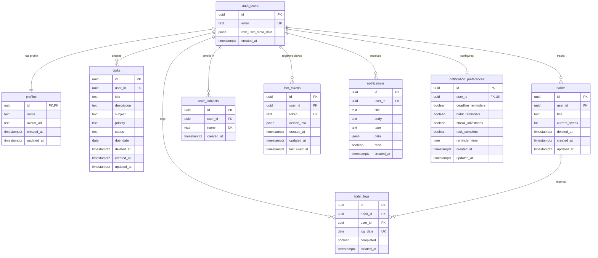
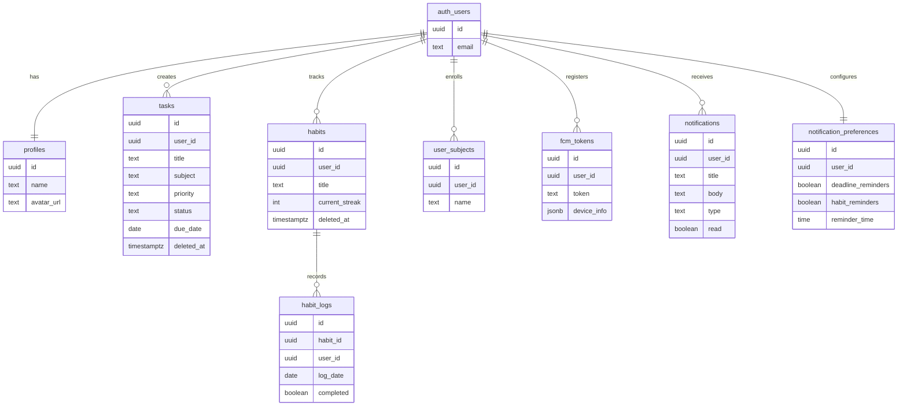

# 📊 ERD FlowDay - Mermaid Diagram

## Cara Menggunakan:
1. Copy code di bawah ini
2. Paste ke: https://mermaid.live/
3. Atau paste ke Markdown yang support Mermaid

---

## ERD Diagram (Mermaid Syntax)



---

## ERD dengan Cardinality Detail

```mermaid
erDiagram
    %% Relasi dengan label yang jelas
    
    auth_users ||--|| profiles : "1:1 has profile"
    auth_users ||--o{ tasks : "1:N creates tasks"
    auth_users ||--o{ habits : "1:N tracks habits"
    auth_users ||--o{ habit_logs : "1:N logs activities"
    auth_users ||--o{ user_subjects : "1:N enrolls in subjects"
    auth_users ||--o{ fcm_tokens : "1:N registers devices"
    auth_users ||--o{ notifications : "1:N receives notifications"
    auth_users ||--|| notification_preferences : "1:1 configures preferences"
    
    habits ||--o{ habit_logs : "1:N records daily logs"
    
    auth_users {
        uuid id PK "Primary Key"
        text email UK "Unique - User email"
        jsonb raw_user_meta_data "User metadata"
        timestamptz created_at "Registration date"
    }
    
    profiles {
        uuid id PK_FK "PK and FK to auth_users"
        text name "User display name"
        text avatar_url "Profile picture URL"
        timestamptz created_at
        timestamptz updated_at
    }
    
    tasks {
        uuid id PK
        uuid user_id FK "FK to auth_users"
        text title "Task title (1-255 chars)"
        text description "Task description"
        text subject "Mata kuliah"
        text priority "low, medium, high"
        text status "todo, in_progress, done"
        date due_date "Deadline date"
        timestamptz deleted_at "Soft delete timestamp"
        timestamptz created_at
        timestamptz updated_at
    }
    
    habits {
        uuid id PK
        uuid user_id FK "FK to auth_users"
        text title "Habit title (1-100 chars)"
        int current_streak "Current streak count"
        timestamptz deleted_at "Soft delete timestamp"
        timestamptz created_at
        timestamptz updated_at
    }
    
    habit_logs {
        uuid id PK
        uuid habit_id FK "FK to habits"
        uuid user_id FK "FK to auth_users"
        date log_date UK "Unique per habit per day"
        boolean completed "Completion status"
        timestamptz created_at
    }
    
    user_subjects {
        uuid id PK
        uuid user_id FK "FK to auth_users"
        text name UK "Subject name (unique per user)"
        timestamptz created_at
    }
    
    fcm_tokens {
        uuid id PK
        uuid user_id FK "FK to auth_users"
        text token UK "Unique FCM token"
        jsonb device_info "Device metadata"
        timestamptz created_at
        timestamptz updated_at
        timestamptz last_used_at "Last notification sent"
    }
    
    notifications {
        uuid id PK
        uuid user_id FK "FK to auth_users"
        text title "Notification title"
        text body "Notification body"
        text type "deadline, habit_reminder, etc"
        jsonb data "Additional data"
        boolean read "Read status"
        timestamptz created_at
    }
    
    notification_preferences {
        uuid id PK
        uuid user_id FK_UK "FK to auth_users (unique)"
        boolean deadline_reminders "Enable deadline reminders"
        boolean habit_reminders "Enable habit reminders"
        boolean streak_milestones "Enable streak notifications"
        boolean task_complete "Enable task complete notifications"
        time reminder_time "Daily reminder time"
        timestamptz created_at
        timestamptz updated_at
    }
```

---

## ERD Simplified (Untuk Presentasi)



---

## Penjelasan Relasi

| Relasi | Cardinality | Label | Penjelasan |
|--------|-------------|-------|------------|
| auth_users → profiles | 1:1 | "has profile" | Setiap user punya 1 profile |
| auth_users → tasks | 1:N | "creates" | User bisa buat banyak tasks |
| auth_users → habits | 1:N | "tracks" | User bisa track banyak habits |
| habits → habit_logs | 1:N | "records" | Habit punya banyak daily logs |
| auth_users → habit_logs | 1:N | "logs" | User punya banyak habit logs |
| auth_users → user_subjects | 1:N | "enrolls in" | User bisa enroll banyak subjects |
| auth_users → fcm_tokens | 1:N | "registers device" | User bisa register banyak devices |
| auth_users → notifications | 1:N | "receives" | User bisa terima banyak notifications |
| auth_users → notification_preferences | 1:1 | "configures" | User punya 1 preference setting |

---

## Simbol Cardinality di Mermaid

```
||--||  : One to One (1:1)
||--o{  : One to Many (1:N)
}o--o{  : Many to Many (N:M)
||--o|  : One to Zero or One (1:0..1)
```

**Penjelasan:**
- `||` = Exactly one (mandatory)
- `o{` = Zero or more (optional many)
- `|{` = One or more (mandatory many)
- `o|` = Zero or one (optional)

---

## Tips Menggunakan Mermaid:

1. **Online Editor**: https://mermaid.live/
2. **VS Code Extension**: Mermaid Preview
3. **GitHub**: Langsung support Mermaid di README.md
4. **Notion**: Support Mermaid code blocks

---

## Contoh Penggunaan di Markdown:

\`\`\`mermaid
erDiagram
    auth_users ||--|| profiles : "has profile"
    auth_users ||--o{ tasks : "creates"
\`\`\`

---

**Dibuat pada**: 4 Mei 2026  
**Project**: FlowDay  
**Format**: Mermaid ERD  
**Status**: ✅ Ready to use
