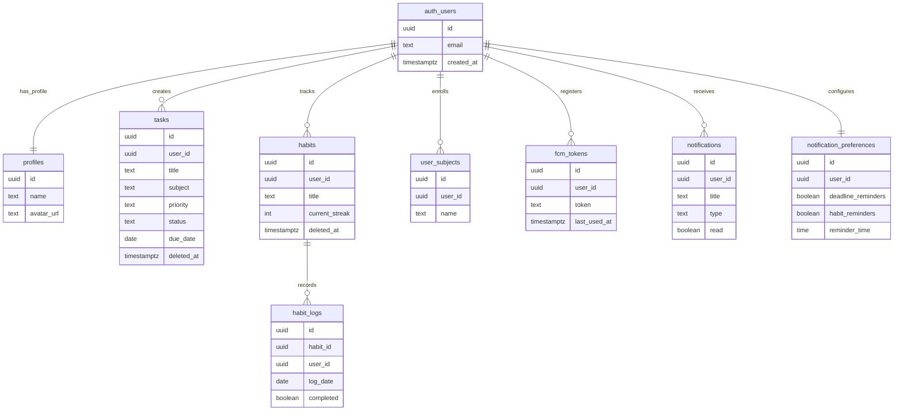
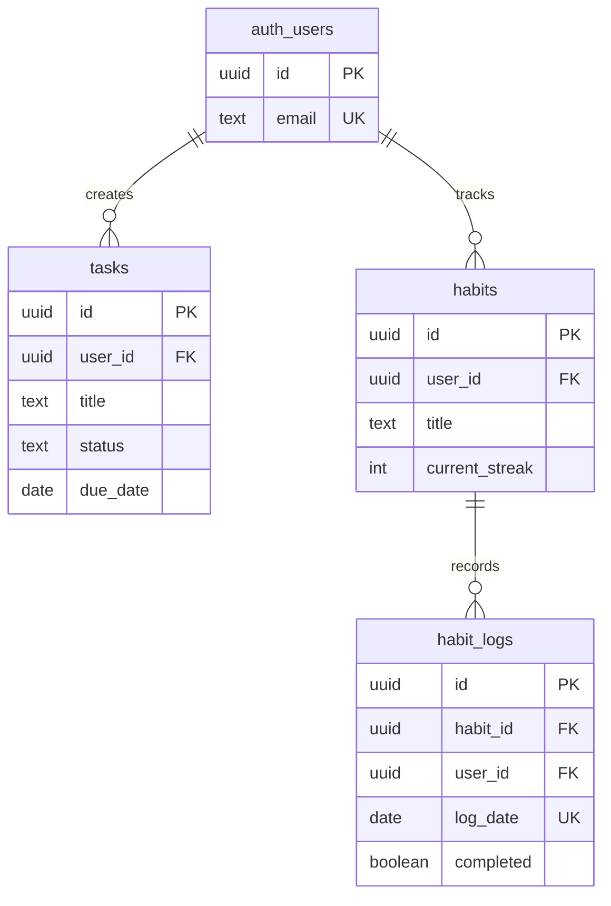
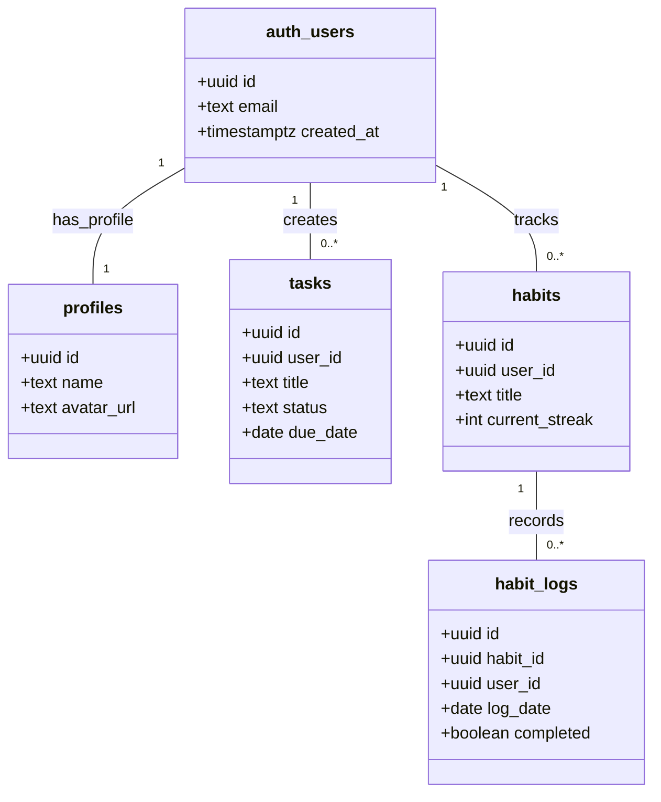

# 📊 ERD FlowDay - Mermaid Advanced (Style Referensi)

## ERD dengan Label Relasi yang Jelas

```mermaid
erDiagram
    %% ============================================
    %% RELASI DENGAN LABEL YANG BERMAKNA
    %% ============================================
    
    %% Core Relations
    auth_users ||--|| profiles : "has_profile"
    auth_users ||--o{ tasks : "creates_tasks"
    auth_users ||--o{ habits : "tracks_habits"
    auth_users ||--o{ user_subjects : "enrolls_in"
    
    %% Habit System
    habits ||--o{ habit_logs : "records_daily"
    auth_users ||--o{ habit_logs : "completes_habit"
    
    %% Notification System
    auth_users ||--o{ fcm_tokens : "registers_device"
    auth_users ||--o{ notifications : "receives_notification"
    auth_users ||--|| notification_preferences : "configures_settings"
    
    %% ============================================
    %% TABLE: auth_users (Supabase Auth)
    %% ============================================
    auth_users {
        uuid id PK "🔑 Primary Key"
        text email UK "📧 Unique Email"
        jsonb raw_user_meta_data "📝 User Metadata"
        timestamptz created_at "📅 Registration Date"
    }
    
    %% ============================================
    %% TABLE: profiles (User Profile)
    %% ============================================
    profiles {
        uuid id PK_FK "🔑 PK + FK → auth_users.id"
        text name "👤 Display Name"
        text avatar_url "🖼️ Profile Picture URL"
        timestamptz created_at "📅 Created"
        timestamptz updated_at "📅 Last Updated"
    }
    
    %% ============================================
    %% TABLE: tasks (Task Management)
    %% ============================================
    tasks {
        uuid id PK "🔑 Primary Key"
        uuid user_id FK "🔗 FK → auth_users.id"
        text title "📝 Task Title (1-255 chars)"
        text description "📄 Task Description"
        text subject "📚 Mata Kuliah"
        text priority "⚡ low | medium | high"
        text status "✅ todo | in_progress | done"
        date due_date "📅 Deadline Date"
        timestamptz deleted_at "🗑️ Soft Delete Timestamp"
        timestamptz created_at "📅 Created"
        timestamptz updated_at "📅 Last Updated"
    }
    
    %% ============================================
    %% TABLE: habits (Habit Tracking)
    %% ============================================
    habits {
        uuid id PK "🔑 Primary Key"
        uuid user_id FK "🔗 FK → auth_users.id"
        text title "📝 Habit Title (1-100 chars)"
        int current_streak "🔥 Current Streak Count"
        timestamptz deleted_at "🗑️ Soft Delete Timestamp"
        timestamptz created_at "📅 Created"
        timestamptz updated_at "📅 Last Updated"
    }
    
    %% ============================================
    %% TABLE: habit_logs (Daily Habit Logs)
    %% ============================================
    habit_logs {
        uuid id PK "🔑 Primary Key"
        uuid habit_id FK "🔗 FK → habits.id"
        uuid user_id FK "🔗 FK → auth_users.id"
        date log_date UK "📅 Log Date (Unique per habit)"
        boolean completed "✅ Completion Status"
        timestamptz created_at "📅 Created"
    }
    
    %% ============================================
    %% TABLE: user_subjects (User Mata Kuliah)
    %% ============================================
    user_subjects {
        uuid id PK "🔑 Primary Key"
        uuid user_id FK "🔗 FK → auth_users.id"
        text name UK "📚 Subject Name (Unique per user)"
        timestamptz created_at "📅 Created"
    }
    
    %% ============================================
    %% TABLE: fcm_tokens (Device Tokens)
    %% ============================================
    fcm_tokens {
        uuid id PK "🔑 Primary Key"
        uuid user_id FK "🔗 FK → auth_users.id"
        text token UK "📱 Unique FCM Token"
        jsonb device_info "📱 Device Metadata"
        timestamptz created_at "📅 Created"
        timestamptz updated_at "📅 Last Updated"
        timestamptz last_used_at "📅 Last Notification Sent"
    }
    
    %% ============================================
    %% TABLE: notifications (Notification History)
    %% ============================================
    notifications {
        uuid id PK "🔑 Primary Key"
        uuid user_id FK "🔗 FK → auth_users.id"
        text title "📢 Notification Title"
        text body "📝 Notification Body"
        text type "🏷️ deadline | habit_reminder | streak_milestone | task_complete"
        jsonb data "📦 Additional Data"
        boolean read "👁️ Read Status"
        timestamptz created_at "📅 Created"
    }
    
    %% ============================================
    %% TABLE: notification_preferences (User Settings)
    %% ============================================
    notification_preferences {
        uuid id PK "🔑 Primary Key"
        uuid user_id FK_UK "🔗 FK → auth_users.id (Unique)"
        boolean deadline_reminders "⏰ Enable Deadline Reminders"
        boolean habit_reminders "🔔 Enable Habit Reminders"
        boolean streak_milestones "🏆 Enable Streak Notifications"
        boolean task_complete "✅ Enable Task Complete Notifications"
        time reminder_time "🕐 Daily Reminder Time (default 20:00)"
        timestamptz created_at "📅 Created"
        timestamptz updated_at "📅 Last Updated"
    }
```

---

## ERD Versi Compact (Untuk Presentasi)



---

## ERD dengan Atribut Relasi (Many-to-Many Style)



---

## Penjelasan Label Relasi

| Dari | Ke | Label | Makna | Cardinality |
|------|-----|-------|-------|-------------|
| auth_users | profiles | has_profile | User memiliki profile | 1:1 |
| auth_users | tasks | creates_tasks | User membuat tasks | 1:N |
| auth_users | habits | tracks_habits | User melacak habits | 1:N |
| habits | habit_logs | records_daily | Habit mencatat log harian | 1:N |
| auth_users | habit_logs | completes_habit | User menyelesaikan habit | 1:N |
| auth_users | user_subjects | enrolls_in | User mendaftar mata kuliah | 1:N |
| auth_users | fcm_tokens | registers_device | User mendaftarkan device | 1:N |
| auth_users | notifications | receives_notification | User menerima notifikasi | 1:N |
| auth_users | notification_preferences | configures_settings | User mengatur preferensi | 1:1 |

---

## Simbol Cardinality Mermaid

```
Simbol di Mermaid ERD:

||--||  : Exactly one to exactly one (1:1)
||--o{  : Exactly one to zero or more (1:N)
}o--o{  : Zero or more to zero or more (N:M)
||--o|  : Exactly one to zero or one (1:0..1)
|o--o{  : Zero or one to zero or more (0..1:N)
}|--|{  : One or more to one or more (1..N:1..M)

Penjelasan Simbol:
|| = Exactly one (mandatory, must exist)
|o = Zero or one (optional, may exist)
}o = Zero or more (optional many)
}| = One or more (mandatory many)
```

---

## Cara Menggunakan:

### 1. **Mermaid Live Editor**
- Buka: https://mermaid.live/
- Paste code di atas
- Export sebagai PNG/SVG

### 2. **VS Code**
- Install extension: "Mermaid Preview"
- Buat file `.md`
- Paste code dalam code block mermaid
- Preview dengan `Ctrl+Shift+V`

### 3. **GitHub/GitLab**
- Langsung paste di README.md
- GitHub otomatis render Mermaid

### 4. **Notion**
- Buat code block
- Pilih language: "Mermaid"
- Paste code

### 5. **Draw.io / Diagrams.net**
- Arrange → Insert → Advanced → Mermaid
- Paste code

---

## Contoh Implementasi di Markdown:

\`\`\`mermaid
erDiagram
    auth_users ||--|| profiles : "has_profile"
    auth_users ||--o{ tasks : "creates_tasks"
    auth_users ||--o{ habits : "tracks_habits"
    
    auth_users {
        uuid id PK
        text email UK
    }
    
    profiles {
        uuid id PK_FK
        text name
    }
    
    tasks {
        uuid id PK
        uuid user_id FK
        text title
    }
    
    habits {
        uuid id PK
        uuid user_id FK
        text title
    }
\`\`\`

---

## Tips untuk Presentasi:

1. **Gunakan versi Compact** untuk slide presentasi
2. **Gunakan versi Advanced** untuk dokumentasi lengkap
3. **Export sebagai PNG** dari mermaid.live untuk PowerPoint
4. **Gunakan emoji** untuk membuat lebih menarik (opsional)

---

## Alternatif: Class Diagram Style

Jika ingin style yang lebih mirip dengan referensi Anda (dengan garis yang lebih jelas):



---

**Dibuat pada**: 4 Mei 2026  
**Project**: FlowDay  
**Format**: Mermaid ERD (Advanced)  
**Status**: ✅ Ready for Mermaid Live
