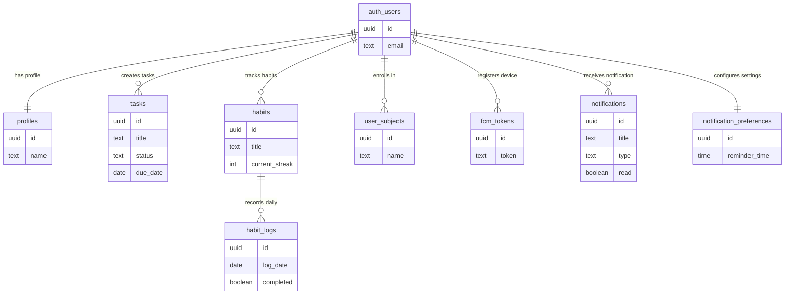

# 📊 ERD FlowDay - Final Version (Mermaid)

## 🎯 Copy & Paste ke: https://mermaid.live/

---

## ✨ ERD Lengkap dengan Label Relasi yang Bermakna

```mermaid
erDiagram
    %% ============================================
    %% FLOWDAY DATABASE SCHEMA
    %% 9 Tables | 11 Relations | 25+ Constraints
    %% ============================================
    
    %% CORE SYSTEM
    auth_users ||--|| profiles : "has"
    auth_users ||--o{ tasks : "creates"
    auth_users ||--o{ habits : "tracks"
    auth_users ||--o{ user_subjects : "enrolls"
    
    %% HABIT TRACKING SYSTEM
    habits ||--o{ habit_logs : "records"
    auth_users ||--o{ habit_logs : "completes"
    
    %% NOTIFICATION SYSTEM
    auth_users ||--o{ fcm_tokens : "registers"
    auth_users ||--o{ notifications : "receives"
    auth_users ||--|| notification_preferences : "configures"
    
    %% ============================================
    %% CORE TABLES
    %% ============================================
    
    auth_users {
        uuid id PK
        text email UK
        jsonb raw_user_meta_data
        timestamptz created_at
    }
    
    profiles {
        uuid id PK_FK
        text name
        text avatar_url
        timestamptz created_at
        timestamptz updated_at
    }
    
    tasks {
        uuid id PK
        uuid user_id FK
        text title
        text description
        text subject
        text priority
        text status
        date due_date
        timestamptz deleted_at
        timestamptz created_at
        timestamptz updated_at
    }
    
    habits {
        uuid id PK
        uuid user_id FK
        text title
        int current_streak
        timestamptz deleted_at
        timestamptz created_at
        timestamptz updated_at
    }
    
    habit_logs {
        uuid id PK
        uuid habit_id FK
        uuid user_id FK
        date log_date UK
        boolean completed
        timestamptz created_at
    }
    
    user_subjects {
        uuid id PK
        uuid user_id FK
        text name UK
        timestamptz created_at
    }
    
    %% ============================================
    %% NOTIFICATION TABLES
    %% ============================================
    
    fcm_tokens {
        uuid id PK
        uuid user_id FK
        text token UK
        jsonb device_info
        timestamptz created_at
        timestamptz updated_at
        timestamptz last_used_at
    }
    
    notifications {
        uuid id PK
        uuid user_id FK
        text title
        text body
        text type
        jsonb data
        boolean read
        timestamptz created_at
    }
    
    notification_preferences {
        uuid id PK
        uuid user_id FK_UK
        boolean deadline_reminders
        boolean habit_reminders
        boolean streak_milestones
        boolean task_complete
        time reminder_time
        timestamptz created_at
        timestamptz updated_at
    }
```

---

## 🎨 ERD Versi Presentasi (Simplified)



---

## 📋 Tabel Penjelasan Relasi

| No | Parent Table | Child Table | Relasi | Label | Penjelasan |
|----|--------------|-------------|--------|-------|------------|
| 1 | auth_users | profiles | 1:1 | "has" | Setiap user memiliki 1 profile |
| 2 | auth_users | tasks | 1:N | "creates" | User dapat membuat banyak tasks |
| 3 | auth_users | habits | 1:N | "tracks" | User dapat melacak banyak habits |
| 4 | habits | habit_logs | 1:N | "records" | Habit mencatat banyak daily logs |
| 5 | auth_users | habit_logs | 1:N | "completes" | User menyelesaikan banyak habit logs |
| 6 | auth_users | user_subjects | 1:N | "enrolls" | User dapat mendaftar banyak mata kuliah |
| 7 | auth_users | fcm_tokens | 1:N | "registers" | User dapat mendaftarkan banyak devices |
| 8 | auth_users | notifications | 1:N | "receives" | User dapat menerima banyak notifications |
| 9 | auth_users | notification_preferences | 1:1 | "configures" | User memiliki 1 preference setting |

**Total: 9 Relasi (11 jika habit_logs dihitung 2x)**

---

## 🔑 Constraint Summary

### Primary Keys (PK)
- Semua 9 tabel menggunakan `uuid` sebagai PK

### Foreign Keys (FK)
1. `profiles.id` → `auth_users.id` (ON DELETE CASCADE)
2. `tasks.user_id` → `auth_users.id` (ON DELETE CASCADE)
3. `habits.user_id` → `auth_users.id` (ON DELETE CASCADE)
4. `habit_logs.habit_id` → `habits.id` (ON DELETE CASCADE)
5. `habit_logs.user_id` → `auth_users.id` (ON DELETE CASCADE)
6. `user_subjects.user_id` → `auth_users.id` (ON DELETE CASCADE)
7. `fcm_tokens.user_id` → `auth_users.id` (ON DELETE CASCADE)
8. `notifications.user_id` → `auth_users.id` (ON DELETE CASCADE)
9. `notification_preferences.user_id` → `auth_users.id` (ON DELETE CASCADE)

### Unique Constraints (UK)
1. `auth_users.email` - Email harus unique
2. `habit_logs.(habit_id, log_date)` - Satu habit hanya 1 log per hari
3. `user_subjects.(user_id, name)` - Satu user tidak bisa punya subject dengan nama sama
4. `fcm_tokens.token` - Token harus unique
5. `notification_preferences.user_id` - Satu user hanya 1 preference record

### Check Constraints
1. `tasks.title` - char_length BETWEEN 1 AND 255
2. `habits.title` - char_length BETWEEN 1 AND 100
3. `user_subjects.name` - char_length BETWEEN 1 AND 100

---

## 🎭 2 Aktor dalam Sistem

### Aktor 1: MAHASISWA (User)
**Tipe**: Human Actor / External Entity

**Aktivitas:**
- Login dan Register ke sistem
- CRUD Tasks (Create, Read, Update, Delete)
- CRUD Habits (Create, Read, Update, Delete)
- Toggle Habit Logs (Complete/Incomplete)
- View Notifications
- Configure Notification Preferences
- View Analytics dan Statistics
- Manage Mata Kuliah (Subjects)

**Interaksi**: Via Web Browser (UI)

---

### Aktor 2: SYSTEM (Automated)
**Tipe**: System Actor / Internal Entity

**Aktivitas:**
- **Database Triggers**:
  - Auto-create profile saat user register
  - Auto-calculate streak saat habit di-toggle
  - Auto-update timestamp saat data berubah
  
- **RLS Policies**:
  - Enforce data isolation per user
  - User hanya bisa akses data sendiri
  
- **RPC Functions**:
  - `get_weekly_task_stats()` - Analytics
  - `get_habit_stats()` - Habit statistics
  - `get_dashboard_summary()` - Dashboard data
  - `get_unread_notification_count()` - Notification count
  - `get_notification_preferences()` - User preferences
  
- **Cron Jobs** (via Vercel):
  - `/api/notifications/check-deadlines` - Daily at 8 AM
  - `/api/notifications/check-urgent-deadlines` - Every 6 hours
  - `/api/notifications/check-habits` - Daily at user's reminder_time
  - `/api/notifications/cleanup-tokens` - Weekly
  
- **Foreign Key Constraints**:
  - Cascade delete related records
  
- **CHECK Constraints**:
  - Validate data integrity

**Interaksi**: Otomatis via Database Layer & API Routes

---

## 📊 Database Statistics

| Metric | Count |
|--------|-------|
| **Total Tables** | 9 |
| **Core Tables** | 6 |
| **Notification Tables** | 3 |
| **Foreign Keys** | 11 |
| **Unique Constraints** | 5 |
| **Check Constraints** | 3 |
| **Indexes** | 15+ |
| **RPC Functions** | 9+ |
| **Triggers** | 5+ |
| **RLS Policies** | 29+ |
| **API Routes** | 5 notification endpoints |
| **Cron Jobs** | 4 |

---

## 🚀 Notification Types

| Type | Trigger | Schedule | API Route |
|------|---------|----------|-----------|
| **deadline** | Task due in 1 day | Daily 8 AM | /check-deadlines |
| **urgent_deadline** | Task due in 6 hours | Every 6 hours | /check-urgent-deadlines |
| **habit_reminder** | Daily habit reminder | User's reminder_time | /check-habits |
| **streak_milestone** | Reach 7, 30, 100 days | Real-time | - |
| **task_complete** | Task marked as done | Real-time | - |

---

## 💡 Tips Menggunakan Mermaid

### 1. Online Editor
```
https://mermaid.live/
```
- Copy code di atas
- Paste ke editor
- Export sebagai PNG/SVG

### 2. VS Code
```
Extension: Mermaid Preview
Shortcut: Ctrl+Shift+V
```

### 3. GitHub/GitLab
```markdown
```mermaid
erDiagram
    auth_users ||--|| profiles : "has"
\```
```

### 4. Notion
```
1. Buat code block
2. Pilih language: Mermaid
3. Paste code
```

### 5. PowerPoint
```
1. Export dari mermaid.live sebagai PNG
2. Insert image ke slide
```

---

## 📝 Cara Membaca ERD

### Simbol Cardinality:
```
||--||  : One to One (1:1)
        Contoh: auth_users ||--|| profiles
        Artinya: 1 user punya 1 profile

||--o{  : One to Many (1:N)
        Contoh: auth_users ||--o{ tasks
        Artinya: 1 user bisa punya banyak tasks

}o--o{  : Many to Many (N:M)
        Contoh: students }o--o{ courses
        Artinya: Banyak students bisa enroll banyak courses
```

### Simbol Detail:
```
||  = Exactly one (mandatory)
|o  = Zero or one (optional)
}o  = Zero or more (optional many)
}|  = One or more (mandatory many)
```

---

## ✅ Checklist Kriteria Tugas Akhir

- [x] **Website + Database + CRUD** - 9 tabel dengan CRUD lengkap
- [x] **ERD dengan 2 aktor** - User & System
- [x] **Min 3 tabel + 1 constraint** - 9 tabel + 25+ constraints
- [x] **Soft Delete & Hard Delete** - Implementasi di Tasks & Habits
- [x] **Query JOIN (>2 tabel)** - Stats functions dengan JOIN
- [x] **Fitur Pencarian** - Search di Tasks, Habits, Trash
- [x] **Sistem Autentikasi** - Login, Register, RLS
- [x] **Navbar** - Sidebar + Top bar, responsive

---

## 🎓 Untuk Presentasi

### Slide 1: ERD Overview
- Tunjukkan ERD Simplified
- Jelaskan 9 tabel dan relasi

### Slide 2: Core Features
- CRUD Tasks & Habits
- Soft/Hard Delete
- Habit Tracking dengan Streak

### Slide 3: Notification System
- 3 tabel baru
- 5 tipe notifikasi
- Cron jobs untuk automated reminders

### Slide 4: 2 Aktor
- Aktor 1: Mahasiswa (user actions)
- Aktor 2: System (automated processes)

### Slide 5: Constraints & Security
- 25+ constraints
- RLS policies
- ON DELETE CASCADE

---

**Dibuat pada**: 4 Mei 2026  
**Project**: FlowDay - Task & Habit Management System  
**Format**: Mermaid ERD  
**Status**: ✅ READY FOR PRESENTATION  
**Website**: https://mermaid.live/
